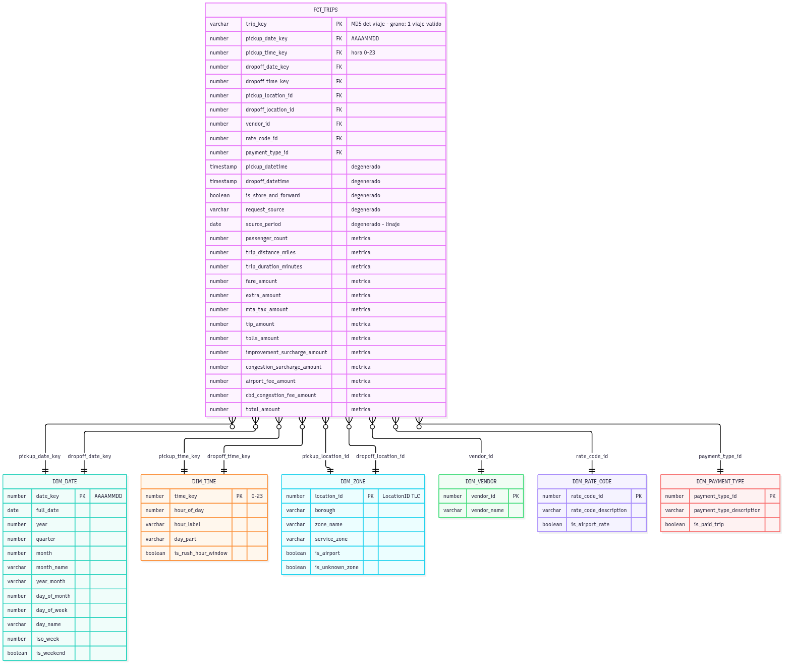
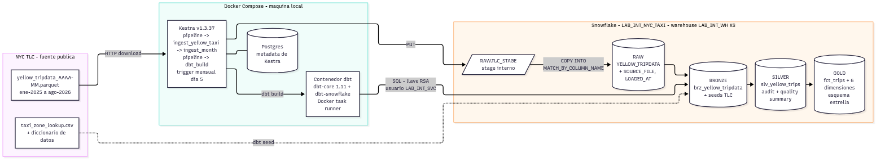

# Guía paso a paso · Lab Integrador I

**Pipeline ELT reproducible de NYC Yellow Taxi (ene-2025 a ago-2026): TLC → Snowflake → dbt (Bronze → Silver → Gold, esquema estrella), orquestado con Kestra en Docker Compose.**

Esta guía documenta cómo se construyó el laboratorio, fase por fase, con el estilo de un mentor senior: qué se hace, con qué archivos, por qué se decidió así y qué se rompió en el camino. Está pensada para que cualquiera pueda **reconstruir todo desde cero**: creas los archivos (el contenido vive en el repo y se enlaza, no se copia aquí), ejecutas los comandos, verificas el resultado y entiendes las razones detrás de cada decisión.

- Repo: `github.com/Dmt-155lbs/Lab-Integrador-I`, carpeta `labs/semana-07/`.
- Máquina de referencia: Windows 11, PowerShell 5.1, Docker Desktop, Git.

## Requisitos previos

- Windows 11 con **PowerShell 5.1**, **Docker Desktop** (abierto y con el motor corriendo), **Git for Windows** y **VS Code**.
- Cuenta de **GitHub**.
- Cuenta de **Snowflake** con acceso al rol `ACCOUNTADMIN` (una cuenta trial sirve).
- Conexión a internet (descarga de Parquet de la TLC e imágenes Docker).

## Convenciones de la guía

- Todos los comandos son de **PowerShell** y se ejecutan desde la raíz del lab, `D:\Daniel\9no SEMESTRE\Data Mining\Lab-Integrador-I\labs\semana-07`, salvo que el paso diga lo contrario.
- Los enlaces a archivos son relativos a esta carpeta `docs/`, por ejemplo [docker-compose.yml](../docker-compose.yml).
- **Regla de oro 1:** los archivos se crean y editan **desde VS Code**, nunca con `echo` ni con `>` de PowerShell 5.1 (genera UTF-16, ver Fase 0).
- **Regla de oro 2:** el repo es la fuente de verdad de los flows de Kestra. No se crean ni se editan flows desde la UI de Kestra.
- **Regla de oro 3:** ningún secreto entra al repo (`.env`, `keys/`, `*.p8`). El `.gitignore` se crea **antes** de generar las llaves.
- **Regla de oro 4:** después de editar un flow, `docker compose restart kestra` (ver Fase 2, error 4).
- **Ejecutar dbt (Fases 3 a 7):** en la UI de Kestra, `http://localhost:8090`, abre el flow `nyc_taxi.dbt_build` → **Execute** → escribe el comando en el input `dbt_command`. Si solo cambiaste archivos del proyecto dbt (`dbt/`) **no hace falta reiniciar Kestra**: el flow copia la carpeta montada en cada ejecución. Reiniciar solo es necesario al crear o editar archivos de **flows** (`kestra/flows/`).

## Arquitectura en una imagen

```text
 TLC (CloudFront)         Kestra (Docker Compose, :8090)              Snowflake (LAB_INT_NYC_TAXI)
 yellow_tripdata_        ┌──────────────────────────────┐
 AAAA-MM.parquet  ─────► │ ingest_yellow_taxi           │──PUT/COPY──► RAW.YELLOW_TRIPDATA
                         │   └─ ingest_month (x mes)    │
                         │ dbt_build (contenedor dbt)   │──dbt build─► BRONZE ─► SILVER ─► GOLD
                         │ pipeline = ingesta + dbt     │             (esquema estrella)
                         └──────────────────────────────┘
```

## Índice de fases

| Fase | Tema | Estado en esta guía |
|---|---|---|
| [Fase 0](#fase-0--repo-y-estructura) | Repo y estructura | Completa |
| [Fase 1a](#fase-1a--infraestructura-en-snowflake) | Infraestructura en Snowflake (rol, warehouse, base, usuario de servicio, monitor) | Completa |
| [Fase 1b](#fase-1b--kestra-con-docker-compose) | Kestra con Docker Compose y prueba de conexión | Completa |
| [Fase 2](#fase-2--ingesta-a-raw) | Ingesta de los Parquet a RAW | Completa |
| [Fase 3](#fase-3--proyecto-dbt-y-capa-bronze) | Proyecto dbt y capa Bronze | Completa |
| [Fase 4](#fase-4--silver) | Silver: perfilado de RAW, limpieza con evidencia y auditoría de calidad | Completa |
| [Fase 5](#fase-5--gold-esquema-estrella) | Gold (esquema estrella): 6 dimensiones y tabla de hechos | Completa |
| [Fase 6](#fase-6--pruebas-de-calidad-dbt-tests) | Pruebas de calidad (dbt tests): 79 pruebas | Completa |
| [Fase 7](#fase-7--diagramas-readme-y-ejecución-desde-cero) | Diagramas, README y ejecución desde cero | Completa |
| [Bitácora](#bitácora-de-errores-resumen) | Resumen de todos los errores de las fases 0 a 7 | Completa |

---

## Fase 0 · Repo y estructura

### Objetivo

Tener un repositorio limpio en GitHub, clonado en una **subcarpeta propia** (no mezclado con otros proyectos del curso como `Pset_2`), con la estructura de carpetas del lab y un `.gitignore` que proteja los secretos **antes** de que existan.

### Archivos

| Ruta (dentro de `labs/semana-07/`) | Para qué sirve |
|---|---|
| [.gitignore](../.gitignore) | Ignora `.env`, `keys/`, `*.p8`, `*.pem`, artefactos de dbt (`target/`, `dbt_packages/`, `logs/`), `data/` y `*.parquet`. |
| `infra/snowflake/` | Scripts SQL de infraestructura (Fase 1a). |
| `kestra/flows/` | Flows de Kestra, fuente de verdad (Fases 1b, 2, 3). |
| `dbt/` | Proyecto dbt (Fase 3 en adelante). |
| `docs/` | Documentación, incluida esta guía. |
| `keys/` | Llaves RSA locales (Fase 1a). **Nunca se sube.** |

> Git no versiona carpetas vacías: `keys/`, `docs/`, etc. aparecerán en GitHub solo cuando contengan archivos versionables (y `keys/` nunca los tendrá, por diseño).

### Pasos

1. En GitHub crea un repositorio nuevo llamado `Lab-Integrador-I` (marca "Add a README file" para que ya exista la rama `main`).

2. En PowerShell entra a la carpeta donde viven tus proyectos del curso:

```powershell
cd "D:\Daniel\9no SEMESTRE\Data Mining"
```

3. Clona el repo. Esto crea la subcarpeta `Lab-Integrador-I` con su propio `.git` dentro:

```powershell
git clone https://github.com/Dmt-155lbs/Lab-Integrador-I.git
```

4. Entra al repo:

```powershell
cd Lab-Integrador-I
```

5. Crea la estructura de carpetas del lab con un solo comando:

```powershell
New-Item -ItemType Directory -Force -Path "labs\semana-07\infra\snowflake","labs\semana-07\kestra\flows","labs\semana-07\dbt","labs\semana-07\docs","labs\semana-07\keys"
```

6. Abre el repo en VS Code y crea el archivo `labs/semana-07/.gitignore` con el contenido de [.gitignore](../.gitignore).

```powershell
code .
```

7. Revisa qué ve Git (solo debe aparecer el `.gitignore`):

```powershell
git status
```

8. Agrega, confirma y sube:

```powershell
git add labs/semana-07/.gitignore
```

```powershell
git commit -m "chore: estructura inicial y .gitignore del lab"
```

```powershell
git push
```

### Verificación

- `git status` dentro de `Lab-Integrador-I` dice `nothing to commit, working tree clean`.
- En la carpeta padre **no** hay repositorio (es lo correcto):

```powershell
git -C "D:\Daniel\9no SEMESTRE\Data Mining" status
```

Debe responder `fatal: not a git repository`.

- En GitHub aparece `labs/semana-07/.gitignore`.

### Decisiones de diseño (por qué)

- **Repo en subcarpeta propia.** `D:\Daniel\9no SEMESTRE\Data Mining` contiene otros proyectos (Pset_2, etc.). Un `.git` en esa carpeta los habría convertido en parte de este repo, con el riesgo de subir cosas ajenas.
- **Estructura por responsabilidad** (`infra`, `kestra`, `dbt`, `docs`): cada fase deja sus archivos en un lugar predecible y el repo se lee como el pipeline.
- **`.gitignore` primero.** Los secretos (`keys/`, `.env`) se crean en fases posteriores; si el `.gitignore` ya existe, un `git add .` distraído no puede subirlos. Es más barato prevenir que limpiar el historial de Git.
- **`labs/semana-07/` como raíz del proyecto.** Todo el lab (compose, `.env`, llaves) vive ahí; los comandos de la guía asumen esa carpeta.

### Errores encontrados y cómo se resolvieron

**Error 0.1 · `git init` en la carpeta padre**

- **Síntoma:** al seguir el "quickstart" de GitHub, `git status` en `D:\Daniel\9no SEMESTRE\Data Mining` mostraba todos los proyectos del curso como archivos sin seguimiento.
- **Causa:** se hizo `git init` directamente en `Data Mining`, que contiene otros proyectos (Pset_2, etc.), en vez de en una subcarpeta.
- **Solución:** crear la subcarpeta y **mover** (no borrar) `.git` y `README.md` dentro.

```powershell
cd "D:\Daniel\9no SEMESTRE\Data Mining"
```

```powershell
New-Item -ItemType Directory -Path "Lab-Integrador-I"
```

```powershell
Move-Item -Force -LiteralPath ".git" -Destination "Lab-Integrador-I\.git"
```

```powershell
Move-Item -LiteralPath "README.md" -Destination "Lab-Integrador-I\README.md"
```

Verificación: `git -C "D:\Daniel\9no SEMESTRE\Data Mining" status` responde `fatal: not a git repository` (correcto) y dentro de `Lab-Integrador-I`, `git status` queda limpio. Nota: `.git` perdió el atributo oculto al moverse; es inofensivo y se restaura con:

```powershell
attrib +h "Lab-Integrador-I\.git"
```

Con el camino de esta guía (clonar en subcarpeta) este error no ocurre.

**Error 0.2 · `README.md` en UTF-16 (Git lo ve como binario)**

- **Síntoma:** `git status`/`git diff` mostraba el `README.md` como `Bin` (binario).
- **Causa:** se creó con `echo "# Lab-Integrador-I" > README.md` en PowerShell 5.1, que escribe en **UTF-16**.
- **Solución:** reescribirlo en UTF-8:

```powershell
Set-Content -Path README.md -Value "# Lab-Integrador-I" -Encoding utf8
```

- **Regla derivada:** crear archivos siempre desde VS Code (UTF-8), nunca con `echo` ni `>` en PowerShell 5.1. (PowerShell 5.1 añade una marca BOM con `-Encoding utf8`; Git lo trata como texto y es inofensivo.)

---

## Fase 1a · Infraestructura en Snowflake

### Objetivo

Crear en Snowflake, **aislado de cualquier otro proyecto**, todo lo que el pipeline necesita: rol, warehouse, base de datos con esquemas de la arquitectura medallón, un usuario de servicio que se autentica con **llave RSA** y un tope de gasto (resource monitor).

### Archivos

| Ruta (dentro de `labs/semana-07/`) | Para qué sirve |
|---|---|
| [infra/snowflake/01_bootstrap.sql](../infra/snowflake/01_bootstrap.sql) | Script idempotente que crea `LAB_INT_ROLE`, `LAB_INT_WH`, `LAB_INT_NYC_TAXI` (esquemas `RAW`, `BRONZE`, `SILVER`, `GOLD`), `LAB_INT_SVC` y `LAB_INT_RM`. Se ejecuta **una vez** en Snowsight como `ACCOUNTADMIN`. |
| `keys/rsa_key.p8` y `keys/rsa_key.pub` | Par de llaves RSA generado localmente. **No se versiona.** |

Objetos que deja creados el script (todos con prefijo `LAB_INT_` para no chocar con Pset_2):

| Objeto | Detalle |
|---|---|
| Rol `LAB_INT_ROLE` | Se concede a `SYSADMIN`, a tu usuario personal y al usuario de servicio. |
| Warehouse `LAB_INT_WH` | `XSMALL`, `AUTO_SUSPEND = 60`, `AUTO_RESUME`, `INITIALLY_SUSPENDED`. |
| Base `LAB_INT_NYC_TAXI` | Esquemas `RAW`, `BRONZE`, `SILVER`, `GOLD`, con dueño `LAB_INT_ROLE`. |
| Usuario `LAB_INT_SVC` | `TYPE = SERVICE` (solo llave RSA, sin contraseña). |
| Resource monitor `LAB_INT_RM` | 10 créditos/mes: `NOTIFY` al 80 %, `SUSPEND` al 100 %; más `GRANT MONITOR` al rol del lab. |

### Pasos

1. Ubícate en la raíz del lab:

```powershell
cd "D:\Daniel\9no SEMESTRE\Data Mining\Lab-Integrador-I\labs\semana-07"
```

2. Crea `infra/snowflake/01_bootstrap.sql` en VS Code con el contenido de [01_bootstrap.sql](../infra/snowflake/01_bootstrap.sql). El script queda en el repo con el placeholder `PEGA_AQUI_TU_LLAVE_PUBLICA`.

3. `openssl` viene con Git pero **no está en el PATH** de PowerShell. Apunta a la copia de Git (ruta por defecto; ajústala si instalaste Git en otro lugar):

```powershell
$openssl = "C:\Program Files\Git\mingw64\bin\openssl.exe"
```

4. Genera la llave privada (RSA 2048, formato PKCS#8, sin passphrase):

```powershell
& $openssl genpkey -algorithm RSA -pkeyopt rsa_keygen_bits:2048 -out keys\rsa_key.p8
```

5. Deriva la llave pública:

```powershell
& $openssl pkey -in keys\rsa_key.p8 -pubout -out keys\rsa_key.pub
```

6. Comprueba que Git **ignora** las llaves (debe mostrar la regla del `.gitignore` que las cubre):

```powershell
git check-ignore -v keys/rsa_key.p8
```

7. Copia la llave pública **sin las cabeceras** `-----BEGIN/END-----` y en una sola línea al portapapeles:

```powershell
(Get-Content keys\rsa_key.pub | Where-Object { $_ -notmatch '-----' }) -join '' | Set-Clipboard
```

8. En Snowsight abre una hoja SQL nueva, pega el contenido de `01_bootstrap.sql` y **reemplaza `PEGA_AQUI_TU_LLAVE_PUBLICA` por el portapapeles, dejando las comillas simples**:

```sql
ALTER USER LAB_INT_SVC SET RSA_PUBLIC_KEY = '<aquí va la llave, entre comillas simples>';
```

   Haz el reemplazo en Snowsight, no en el archivo del repo (así el script del repo sigue siendo reutilizable).

9. Ejecuta todo el script con **Run All** (`Ctrl+Shift+Enter`), logueado como `ACCOUNTADMIN`. Revisa que **las seis secciones** hayan corrido sin error (ver Error 1a.3).

10. Obtén tu *account identifier* (lo necesitarás en la Fase 1b) ejecutando esto en Snowsight:

```sql
SELECT CURRENT_ORGANIZATION_NAME() || '-' || CURRENT_ACCOUNT_NAME();
```

    Devuelve algo como `ORGNAME-ACCOUNTNAME` (en el caso de Daniel, `AUOVQVK-BI53708`). No es un secreto.

11. Cierra la fase con un commit. **Ojo:** las rutas de Git son relativas a la carpeta donde estás (Error 1a.1):

```powershell
git add infra/snowflake/01_bootstrap.sql
```

```powershell
git commit -m "feat(infra): script de bootstrap de Snowflake"
```

```powershell
git push
```

### Verificación

Ejecuta estas consultas en Snowsight (como `ACCOUNTADMIN`):

```sql
SHOW SCHEMAS IN DATABASE LAB_INT_NYC_TAXI;
```

Deben aparecer `RAW`, `BRONZE`, `SILVER` y `GOLD` con `owner = LAB_INT_ROLE`.

```sql
SHOW WAREHOUSES LIKE 'LAB_INT_WH';
```

`size = X-Small`, `auto_suspend = 60`, `state = SUSPENDED`, `resource_monitor = LAB_INT_RM`.

```sql
SHOW RESOURCE MONITORS LIKE 'LAB_INT_RM';
```

`credit_quota = 10`, `frequency = MONTHLY`, `used_credits = 0`.

```sql
DESC USER LAB_INT_SVC;
```

`TYPE = SERVICE` y `RSA_PUBLIC_KEY_FP` con valor (la huella confirma que la llave quedó registrada).

Aislamiento: cambia al rol del lab y lista lo que ve.

```sql
USE ROLE LAB_INT_ROLE;
```

```sql
SHOW DATABASES;
```

Debe ver `LAB_INT_NYC_TAXI` y los objetos por defecto de Snowflake (como `SNOWFLAKE_SAMPLE_DATA`, que son públicos), y **ningún objeto de Pset_2**.

La verificación definitiva es la de la Fase 1b: que Kestra se conecte como `LAB_INT_SVC` con la llave. En su momento Daniel también verificó desde un contenedor Python temporal conectando como `LAB_INT_SVC`: esquemas con owner `LAB_INT_ROLE`, warehouse suspendido y 0 créditos usados.

### Decisiones de diseño (por qué)

- **Prefijo `LAB_INT_` en todo.** Otro proyecto (Pset_2) vive en la misma cuenta; el prefijo y un rol propio garantizan que el lab no ve ni toca sus objetos.
- **Rol propio en jerarquía.** `GRANT ROLE LAB_INT_ROLE TO ROLE SYSADMIN` sigue la práctica recomendada por Snowflake (SYSADMIN hereda lo que crean los roles de proyecto). También se concede a tu usuario personal para explorar los datos en Snowsight.
- **Base creada por SYSADMIN y entregada con `GRANT OWNERSHIP ... COPY CURRENT GRANTS`; esquemas creados por `LAB_INT_ROLE`.** Así el rol del lab es dueño de lo que dbt va a crear y reemplazar, sin problemas de permisos.
- **Warehouse XSMALL con `AUTO_SUSPEND = 60` e `INITIALLY_SUSPENDED`.** 1 crédito/hora solo mientras trabaja; se apaga solo tras 60 s sin uso.
- **Resource monitor.** Con 10 créditos/mes y `SUSPEND` al 100 % un error (un bucle, una consulta descontrolada) no puede salir caro. Se agrega `GRANT MONITOR` para que el rol del lab pueda **ver** (no modificar) el consumo.
- **Usuario de servicio con llave RSA (y no usuario/contraseña en `.env`).** Tres razones:
  1. Tu contraseña personal nunca queda en archivos.
  2. Kestra y dbt no actúan como `ACCOUNTADMIN`, sino con un usuario de privilegios mínimos.
  3. Snowflake está bloqueando el acceso programático solo con contraseña, y los usuarios `TYPE = SERVICE` ni siquiera admiten contraseña.
- **`ALTER USER ... SET RSA_PUBLIC_KEY` separado del `CREATE USER`.** Permite **rotar la llave** re-ejecutando solo esa parte del script.
- **Todo es `IF NOT EXISTS`.** El script se puede re-ejecutar sin romper nada.

### Errores encontrados y cómo se resolvieron

**Error 1a.1 · `git add` con la ruta completa falla**

- **Síntoma:** `git add labs/semana-07/infra/snowflake/01_bootstrap.sql` respondía que la ruta no coincidía con ningún archivo.
- **Causa:** el comando se ejecutó estando dentro de `labs\semana-07`; las rutas de Git son relativas a la carpeta **actual**, no a la raíz del repo.
- **Solución:**

```powershell
git add infra/snowflake/01_bootstrap.sql
```

**Error 1a.2 · Error de sintaxis al ejecutar el `ALTER USER`**

- **Síntoma:** Snowsight marcaba error de sintaxis en la línea de `RSA_PUBLIC_KEY`.
- **Causa:** al pegar la llave se perdieron las comillas simples del placeholder `RSA_PUBLIC_KEY = '<...>'`. La llave contiene `+` y `/`, que sin comillas Snowflake interpreta como operadores.
- **Solución:** restaurar las comillas simples alrededor de la llave (una sola línea, sin cabeceras).

**Error 1a.3 · El resource monitor no quedó asignado al warehouse**

- **Síntoma:** `SHOW WAREHOUSES LIKE 'LAB_INT_WH'` mostraba `resource_monitor` vacío.
- **Causa:** Run All se detuvo antes de la sección 6 (por el error anterior).
- **Solución:** re-ejecutar la sección 6 del script (crear el monitor y `ALTER WAREHOUSE ... SET RESOURCE_MONITOR`); es idempotente, no duplica nada.

**Error 1a.4 · Desde el rol del lab, `resource_monitor` se veía `null`**

- **Síntoma:** conectado como `LAB_INT_ROLE`, el warehouse mostraba `resource_monitor = null` aunque sí estaba asignado.
- **Causa:** el rol no tenía permiso para **ver** el monitor.
- **Solución:** conceder `MONITOR` sobre el monitor (línea ya incluida en el script):

```sql
GRANT MONITOR ON RESOURCE MONITOR LAB_INT_RM TO ROLE LAB_INT_ROLE;
```

**Error 1a.5 · `openssl` no se reconoce como comando**

- **Síntoma:** PowerShell responde que `openssl` no es un cmdlet, función o programa reconocido.
- **Causa:** `openssl` no está en el PATH de Windows; solo viene dentro de Git for Windows.
- **Solución:** invocarlo por ruta completa (`$openssl = "C:\Program Files\Git\mingw64\bin\openssl.exe"` y luego `& $openssl ...`), como en los pasos 3 a 5.

---

## Fase 1b · Kestra con Docker Compose

### Objetivo

Levantar Kestra (orquestador) con Docker Compose, con configuración **reproducible** (versión fija, `.env` para lo variable y secreto) y demostrar que puede conectarse a Snowflake como `LAB_INT_SVC` con la llave RSA.

### Archivos

| Ruta (dentro de `labs/semana-07/`) | Para qué sirve |
|---|---|
| [docker-compose.yml](../docker-compose.yml) | Servicios `postgres` (BD interna de Kestra) y `kestra` (`kestra/kestra:v1.3.37`, UI en el puerto 8090). Lee todo lo variable del `.env`. |
| [.env.example](../.env.example) | Plantilla **versionada** con las variables necesarias. |
| `.env` | Tu copia real con valores y secretos. **No se versiona** (lo ignora `.gitignore`). |
| [kestra/flows/main_nyc_taxi.test_snowflake.yml](../kestra/flows/main_nyc_taxi.test_snowflake.yml) | Flow de prueba: consulta funciones de contexto (`CURRENT_USER()`, `CURRENT_ROLE()`, ...) para confirmar la conexión. |

Cómo llegan los valores a los flows:

| En `.env` | En el contenedor | En un flow |
|---|---|---|
| `SNOWFLAKE_ACCOUNT` (y `_USER`, `_ROLE`, `_WAREHOUSE`, `_DATABASE`) | `ENV_SNOWFLAKE_ACCOUNT`, ... | `{{ envs.snowflake_account }}`, ... |
| `SNOWFLAKE_PRIVATE_KEY_B64` (llave privada en base64) | `SECRET_SNOWFLAKE_PRIVATE_KEY` | `{{ secret('SNOWFLAKE_PRIVATE_KEY') }}` |

### Pasos

1. Crea en VS Code, con el contenido del repo, estos tres archivos: [docker-compose.yml](../docker-compose.yml), [.env.example](../.env.example) y [kestra/flows/main_nyc_taxi.test_snowflake.yml](../kestra/flows/main_nyc_taxi.test_snowflake.yml). Respeta el nombre exacto del flow (Error 1b.1).

2. Crea tu `.env` a partir de la plantilla:

```powershell
Copy-Item .env.example .env
```

3. Abre `.env` en VS Code y completa:
   - `SNOWFLAKE_ACCOUNT`: el identificador de la Fase 1a (`ORGNAME-ACCOUNTNAME`).
   - `KESTRA_ADMIN_PASSWORD`: 8+ caracteres, al menos una mayúscula y un número; **solo letras y números** (evita `: # " '`, porque se inserta dentro de un YAML). `KESTRA_ADMIN_USER` debe tener formato de email.
   - Los demás valores (`LAB_INT_SVC`, `LAB_INT_ROLE`, `LAB_INT_WH`, `LAB_INT_NYC_TAXI`) ya vienen bien.

4. Codifica la llave privada en base64 (una sola línea) y cópiala al portapapeles:

```powershell
[Convert]::ToBase64String([IO.File]::ReadAllBytes((Resolve-Path "keys\rsa_key.p8"))) | Set-Clipboard
```

5. Pega el portapapeles en `.env` después de `SNOWFLAKE_PRIVATE_KEY_B64=` (sin comillas, sin espacios, en una sola línea).

6. Valida la sintaxis del compose y que no falte ninguna variable. Si todo está bien **no imprime nada**:

```powershell
docker compose config --quiet
```

   ⚠️ No ejecutes `docker compose config` sin `--quiet` y compartas la salida: imprime el compose ya resuelto, con la llave privada incluida.

7. Levanta los servicios (la primera vez descarga las imágenes):

```powershell
docker compose up -d
```

8. Revisa el estado:

```powershell
docker compose ps
```

9. Sigue el arranque de Kestra. `Ctrl+C` sale de los logs sin detener el contenedor:

```powershell
docker compose logs -f kestra
```

10. Abre la UI en el navegador: `http://localhost:8090` e inicia sesión con `KESTRA_ADMIN_USER` y `KESTRA_ADMIN_PASSWORD` de tu `.env`.

11. En la UI ve a *Flows*, namespace `nyc_taxi`, flow `test_snowflake`, y pulsa **Execute**. Abre el log de la tarea `resultado`.

12. Confirma que `.env` y `keys/` no aparecen en Git y haz el commit (el `.env` real **no** se sube):

```powershell
git status
```

```powershell
git add docker-compose.yml .env.example kestra/flows/main_nyc_taxi.test_snowflake.yml
```

```powershell
git commit -m "feat(kestra): docker compose y flow de prueba de conexion a Snowflake"
```

```powershell
git push
```

### Verificación

- `docker compose ps` muestra `postgres` como `healthy` y `kestra` en ejecución, con el puerto `8090->8080`.
- La UI abre en `http://localhost:8090` y pide login.
- El flow `test_snowflake` termina en **SUCCESS** y el log muestra algo como:

```text
Conexion OK -> {"ROL":"LAB_INT_ROLE","USUARIO":"LAB_INT_SVC","WAREHOUSE":"LAB_INT_WH","BASE_DE_DATOS":"LAB_INT_NYC_TAXI"}
```

- Costo: 0 créditos, porque solo se consultan funciones de contexto y el warehouse no llega a encenderse.

### Decisiones de diseño (por qué)

- **Kestra `v1.3.37` fija, no `latest`.** Es la misma línea LTS que se usó en clase. La 2.0 salió en septiembre de 2026 y elimina `pluginDefaults` y `ForEach`, dos piezas que este lab usa. Fijar la versión hace el laboratorio reproducible.
- **Aislado para convivir con otro Kestra:** proyecto compose `lab-integrador-i` (volúmenes propios), carpeta temporal `/tmp/labint-kestra-wd` propia y puerto **8090** (el otro Kestra usa 8080).
- **Configuración no secreta como `ENV_*`, secreto como `SECRET_*`.** Kestra expone `ENV_SNOWFLAKE_ACCOUNT` como `{{ envs.snowflake_account }}` y `SECRET_SNOWFLAKE_PRIVATE_KEY` (en base64) como `{{ secret('SNOWFLAKE_PRIVATE_KEY') }}`. Los flows no contienen ningún valor sensible.
- **`${VAR:?mensaje}` en el compose.** Si falta una variable en `.env`, `docker compose` falla enseguida con un mensaje claro en lugar de arrancar a medias.
- **Flows sincronizados desde `./kestra/flows`.** El repo es la fuente de verdad: lo que está en Git es lo que corre. Por eso no se editan flows en la UI.
- **`user: root` y el socket de Docker montado.** dbt correrá en un contenedor hijo lanzado por Kestra (Fase 3).
- **Carpeta temporal con la misma ruta dentro y fuera del contenedor** (`/tmp/labint-kestra-wd`). Los contenedores que lanza Kestra los crea el daemon de Docker del host y montan directorios de trabajo por ruta; si la ruta no coincide en ambos lados, no los encuentran.
- **`stop_grace_period: 6m`.** Deja terminar las tareas en curso antes de matar Kestra al apagar.
- **Login por basic-auth desde `.env`.** La UI no queda abierta aunque solo sea `localhost`.
- **Prueba con funciones de contexto.** Demuestra rol, usuario y warehouse sin gastar créditos.

### Errores encontrados y cómo se resolvieron

**Error 1b.1 · El flow no aparecía en la UI**

- **Síntoma:** Kestra arrancaba bien, pero el flow `test_snowflake` no se veía en `nyc_taxi`.
- **Causa:** al sincronizar desde carpeta, Kestra toma el **tenant** del nombre del archivo (el texto antes del primer `_`). El archivo se llamaba `nyc_taxi.test_snowflake.yml`, así que quedó en el tenant `nyc`, invisible desde el tenant `main` que usa la UI.
- **Solución:** nombrar los archivos `main_<namespace>.<flow_id>.yml`, por ejemplo `main_nyc_taxi.test_snowflake.yml`. Regla para todos los flows del lab.

**Error 1b.2 · Kestra escribió 9 flows de tutorial dentro del repo**

- **Síntoma:** aparecieron archivos `main_tutorial_*.yml` (9 flows de ejemplo) dentro de `kestra/flows`, es decir, dentro del repo.
- **Causa:** Kestra crea por defecto flows de tutorial y, al estar la carpeta sincronizada, los materializó en disco.
- **Solución:**

```powershell
docker compose down -v
```

  (`-v` borra solo los volúmenes de este proyecto compose, `postgres-data` y `kestra-data`; no pasa nada porque los flows viven en el repo). Después:
  1. Agregar bajo `kestra:` en `KESTRA_CONFIGURATION` del compose: `tutorial-flows: enabled: false` (ya está en [docker-compose.yml](../docker-compose.yml)).
  2. Borrar los archivos de tutorial:

```powershell
Remove-Item kestra\flows\main_tutorial_*.yml
```

  3. Renombrar el flow al formato correcto (Error 1b.1):

```powershell
Rename-Item kestra\flows\nyc_taxi.test_snowflake.yml main_nyc_taxi.test_snowflake.yml
```

  4. Volver a levantar:

```powershell
docker compose up -d
```

- **Regla derivada:** no crear ni editar flows desde la UI; todo va por archivos en `kestra/flows/`.

---

## Fase 2 · Ingesta a RAW

### Objetivo

Descargar los 20 Parquet mensuales de NYC Yellow Taxi (2025-01 a 2026-08) desde la TLC y cargarlos **tal cual** en `RAW.YELLOW_TRIPDATA` de Snowflake, con un proceso **idempotente** (re-ejecutarlo no duplica filas) y tolerante a meses que la TLC aún no ha publicado.

### Archivos

| Ruta (dentro de `labs/semana-07/`) | Para qué sirve |
|---|---|
| [kestra/flows/main_nyc_taxi.ingest_yellow_taxi.yml](../kestra/flows/main_nyc_taxi.ingest_yellow_taxi.yml) | Flow **principal**. Crea (si no existen) el file format `RAW.FF_PARQUET`, el stage interno `RAW.TLC_STAGE` y la tabla `RAW.YELLOW_TRIPDATA`; recorre los 20 meses con `ForEach` (2 en paralelo) llamando al subflow; al final muestra un resumen de filas por periodo. |
| [kestra/flows/main_nyc_taxi.ingest_month.yml](../kestra/flows/main_nyc_taxi.ingest_month.yml) | **Subflow** que carga un mes: omite si ya está, verifica que la TLC lo publicó, descarga, sube al stage, borra el mes y hace `COPY INTO`. También se ejecuta solo para recargar un mes puntual. |

Tabla destino `RAW.YELLOW_TRIPDATA`: las **21 columnas de la TLC** más 3 de metadata (`SOURCE_FILE`, `SOURCE_ROW_NUMBER`, `LOADED_AT`).

Recorrido de un mes dentro de `ingest_month`:

```text
already_loaded? --sí--> log "ya está en RAW" (fin)
       │no (o force_reload)
check_published (Range: bytes=0-0) --403--> WARN "aún no publica" (fin, sin error)
       │206
download -> upload_to_stage (PUT) -> delete_month -> copy_into_raw -> rows_loaded -> log
       └─ finally: purge_files (borra el Parquet del storage de Kestra)
```

### Pasos

1. Crea en VS Code los dos flows con el contenido de [main_nyc_taxi.ingest_yellow_taxi.yml](../kestra/flows/main_nyc_taxi.ingest_yellow_taxi.yml) y [main_nyc_taxi.ingest_month.yml](../kestra/flows/main_nyc_taxi.ingest_month.yml). Cuida la sangría del YAML (Error 2.2).

2. Kestra solo lee los flows al **arrancar** en Windows (Error 2.4), así que reinícialo:

```powershell
docker compose restart kestra
```

3. Cuando la UI vuelva a responder (`http://localhost:8090`), confirma que en el namespace `nyc_taxi` aparecen `ingest_yellow_taxi`, `ingest_month` y `test_snowflake`.

4. **Prueba corta primero.** Ejecuta `ingest_yellow_taxi` (*Execute*) cambiando el input `months` para dejar solo `2025-01` y `2026-08` (deja `force_reload` en `false`). Así validas el camino feliz y el camino "no publicado" en un par de minutos.

5. Revisa los logs de cada `run_month`:
   - `2025-01`: `2025-01: 3475226 filas cargadas en RAW.YELLOW_TRIPDATA`.
   - `2026-08`: advertencia (WARN) `la TLC aun no publica este archivo (HTTP 403)`, **sin error**.

6. Comprueba en Snowsight (rol `LAB_INT_ROLE`, warehouse `LAB_INT_WH`):

```sql
SELECT COUNT(*) FROM LAB_INT_NYC_TAXI.RAW.YELLOW_TRIPDATA;
```

   Debe dar `3475226`.

7. **Carga completa.** Vuelve a ejecutar `ingest_yellow_taxi` con los valores por defecto (los 20 meses). Tarda unos 9 minutos (≈1 minuto por mes, 2 en paralelo).

8. **Prueba de idempotencia.** Ejecuta `ingest_yellow_taxi` otra vez con los valores por defecto: los 19 meses publicados deben decir `ya esta en RAW ... Se omite` y `2026-08` debe seguir en WARN por no publicado.

9. **Prueba de recarga forzada.** Ejecuta el subflow `ingest_month` directamente con `month = 2026-07` y `force_reload = true`. El conteo final sigue siendo `3530109` (borra el mes y lo vuelve a cargar, no duplica). Requiere que `ingest_yellow_taxi` se haya ejecutado al menos una vez, porque es quien crea las estructuras de RAW.

10. Commit:

```powershell
git add kestra/flows/main_nyc_taxi.ingest_yellow_taxi.yml kestra/flows/main_nyc_taxi.ingest_month.yml
```

```powershell
git commit -m "feat(kestra): ingesta idempotente de NYC Yellow Taxi a RAW"
```

```powershell
git push
```

### Verificación

Filas por periodo en RAW (deben coincidir exactamente con la fuente):

```sql
SELECT SUBSTR(SOURCE_FILE, -15, 7) AS PERIODO, COUNT(*) AS FILAS
FROM LAB_INT_NYC_TAXI.RAW.YELLOW_TRIPDATA
GROUP BY 1
ORDER BY 1;
```

| Periodo | Filas | Periodo | Filas |
|---|---:|---|---:|
| 2025-01 | 3.475.226 | 2025-11 | 4.181.444 |
| 2025-02 | 3.577.543 | 2025-12 | 4.305.006 |
| 2025-03 | 4.145.257 | 2026-01 | 3.724.889 |
| 2025-04 | 3.970.553 | 2026-02 | 3.399.866 |
| 2025-05 | 4.591.845 | 2026-03 | 3.952.451 |
| 2025-06 | 4.322.960 | 2026-04 | 3.831.240 |
| 2025-07 | 3.898.963 | 2026-05 | 4.090.836 |
| 2025-08 | 3.574.091 | 2026-06 | 3.837.248 |
| 2025-09 | 4.251.015 | 2026-07 | 3.530.109 |
| 2025-10 | 4.428.699 | **TOTAL (19 meses)** | **75.089.241** |

```sql
SELECT COUNT(*) AS TOTAL, COUNT(DISTINCT SOURCE_FILE) AS ARCHIVOS
FROM LAB_INT_NYC_TAXI.RAW.YELLOW_TRIPDATA;
```

Debe dar `75089241` filas y `19` archivos. `2026-08` aún no existe en la TLC (HTTP 403), por eso son 19 y no 20.

Estos números se obtuvieron **antes** de cargar, leyendo los metadatos de los Parquet remotos con DuckDB, algo como:

```sql
SELECT COUNT(*) FROM read_parquet('https://d37ci6vzurychx.cloudfront.net/trip-data/yellow_tripdata_2025-01.parquet');
```

La carga en Snowflake coincidió **exactamente** con la fuente. Y la idempotencia queda demostrada por los pasos 8 y 9: la segunda ejecución omite todo y la recarga forzada de 2026-07 mantiene 3.530.109 filas.

### Decisiones de diseño (por qué)

- **RAW "tal cual" + 3 columnas de metadata.** RAW es el aterrizaje: no se limpia ni se transforma nada, así siempre puedes reconstruir las capas siguientes. `SOURCE_FILE`, `SOURCE_ROW_NUMBER` y `LOADED_AT` dan linaje (de qué archivo y fila viene cada registro y cuándo se cargó).
- **`MATCH_BY_COLUMN_NAME = CASE_INSENSITIVE`.** Desde 2026-06 los Parquet traen una columna nueva, `request_source` (schema drift). Emparejar por **nombre** absorbe el cambio sin romper los meses anteriores (quedan en `NULL`). Emparejar por posición habría corrido las columnas.
- **`USE_LOGICAL_TYPE = TRUE` en el file format.** Respeta los tipos lógicos del Parquet y los timestamps llegan como `TIMESTAMP_NTZ` correctos, no como enteros.
- **Stage interno + `PUT` (`Upload`) con `compress = false`.** El Parquet ya viene comprimido; recomprimirlo no aporta. `PURGE = TRUE` en el `COPY` borra el archivo del stage al terminar, así el stage no acumula datos.
- **`INCLUDE_METADATA`.** Llena `SOURCE_FILE`, `SOURCE_ROW_NUMBER` y `LOADED_AT` con `METADATA$FILENAME`, `METADATA$FILE_ROW_NUMBER` y `METADATA$START_SCAN_TIME` directamente en el `COPY`.
- **`FORCE = TRUE`.** Snowflake recuerda 64 días qué archivos cargó; con `FORCE` el `COPY` no se los salta, y la idempotencia la controla **nuestra** lógica (omitir mes existente / borrar antes de recargar), que es explícita y visible.
- **Idempotencia en dos capas.**
  1. Si el mes ya está en RAW, se omite (salvo `force_reload`).
  2. Si se recarga, primero se hace `DELETE` del mes y luego `COPY`: nunca duplica.
- **Verificar que la TLC publicó el archivo con `Range: bytes=0-0`.** Pide un solo byte: `206` = existe, `403` = aún no publicado. En el segundo caso se registra un WARN y termina sin error, y se cargará en una ejecución futura (por eso el pipeline mensual atrapa meses nuevos solo). `allowFailed: true` evita que el 403 tumbe la tarea.
- **`concurrencyLimit: 2`.** Dos meses en paralelo acelera sin sobrecargar el warehouse XSMALL ni la red.
- **`transmitFailed: true` y `wait: true`.** Si un mes falla, el flow principal lo sabe y falla también (no oculta errores).
- **`finally: PurgeCurrentExecutionFiles`.** Borra el Parquet descargado del storage de Kestra, aunque la tarea falle.
- **`pluginDefaults` para Snowflake** en cada flow: URL, usuario, llave, rol, warehouse y base se declaran una sola vez.
- **La ejecución programada no vive aquí.** El trigger mensual está en el flow `pipeline` (Fase 3) para no ejecutar la ingesta dos veces.
- **`ingest_month` asume que las estructuras de RAW existen.** Las crea `ingest_yellow_taxi`; por eso se ejecuta primero el principal.

### Errores encontrados y cómo se resolvieron

**Error 2.1 · `load_raw` falla con `Connection is closed`**

- **Síntoma:** la tarea de carga terminaba en error con el mensaje genérico `Connection is closed`.
- **Causa:** el error real estaba en los logs del contenedor: `Actual statement count 2 did not match the desired statement count 1`. El plugin Snowflake de Kestra 1.3.37 envía `DELETE` + `COPY` como **una sola** sentencia con dos instrucciones, y Snowflake exige declarar cuántas sentencias vienen en el lote (en versiones nuevas del plugin se corrigió con `MULTI_STATEMENT_COUNT = 0`).
- **Cómo verlo:**

```powershell
docker compose logs kestra --tail 300
```

- **Solución:** separar en **dos tareas `Query`**: `delete_month` y `copy_into_raw` (como están en [ingest_month](../kestra/flows/main_nyc_taxi.ingest_month.yml)).
- **Consecuencia:** ya no es una transacción, pero sigue sin duplicar: si el `COPY` falla, el mes queda en 0 filas y se recarga solo en la siguiente ejecución.

**Error 2.2 · Un error de sangría dejó una copia extra del flow (`main_nyc_taxi_ingest_month.yml`)**

- **Síntoma:** en `kestra/flows` apareció un archivo `main_nyc_taxi_ingest_month.yml` (con `_` en lugar de `.`) que nadie había creado.
- **Causa:** durante la edición, un error de sangría (YAML inválido) hizo que Kestra no pudiera leer el archivo y escribiera por su cuenta la **versión anterior** con ese nombre.
- **Solución:** borrar esa copia y arreglar la sangría:

```powershell
Remove-Item kestra\flows\main_nyc_taxi_ingest_month.yml
```

- **Prevención:** VS Code marca los errores de YAML; revisa la sangría antes de guardar, y no edites flows desde la UI.

**Error 2.3 · El subflow decía `Input month ... isn't declared at the subflow inputs`**

- **Síntoma:** al invocarse desde `ingest_yellow_taxi`, el subflow fallaba diciendo que el input `month` no estaba declarado, aunque el archivo sí lo declaraba. Ejecutado **directo** funcionaba.
- **Causa:** la revisión 2 del flow quedó **corrupta dentro de Kestra**: se guardó justo en el momento del YAML roto (Error 2.2).
- **Solución:** generar una revisión nueva: un cambio mínimo en el archivo (por ejemplo, un espacio o una palabra en la `description`), guardar y reiniciar:

```powershell
docker compose restart kestra
```

**Error 2.4 · Los cambios en los archivos de flows no se reflejaban**

- **Síntoma:** se editaba un flow en VS Code, se guardaba y Kestra seguía ejecutando la versión anterior.
- **Causa:** en Windows, Kestra **no detecta en caliente** los cambios de la carpeta montada (el bind mount de Docker Desktop no propaga eventos de archivo); solo lee los flows al arrancar.
- **Solución:** tras editar cualquier flow:

```powershell
docker compose restart kestra
```

**Nota 2.5 · En la UI el subflow `ingest_month` muestra el campo `month` vacío**

- **Síntoma:** al ejecutar `ingest_month` a mano, `month` aparece como texto libre vacío.
- **Causa:** no es un error. La lista de meses vive en el flow **principal**; `month` en el subflow es un `STRING` con validador `^\d{4}-(0[1-9]|1[0-2])$`.
- **Uso:** escribe el periodo (por ejemplo `2026-07`) al ejecutarlo directo.

---

## Fase 3 · Proyecto dbt y capa Bronze

### Objetivo

Crear el proyecto dbt que se conecta a Snowflake con la llave RSA, cargar los **seeds** (catálogos oficiales de la TLC) y construir la capa **Bronze** de forma **incremental por archivo**, ejecutado desde Kestra en un contenedor. Además, dejar el flow `pipeline` que encadena ingesta y dbt con una ejecución mensual.

### Archivos

| Ruta (dentro de `labs/semana-07/`) | Para qué sirve |
|---|---|
| [dbt/nyc_taxi/dbt_project.yml](../dbt/nyc_taxi/dbt_project.yml) | Configuración del proyecto: capas (`bronze` incremental, `silver` y `gold` tabla), seeds con tipos de columna fijos y variables de calendario. |
| [dbt/nyc_taxi/profiles.yml](../dbt/nyc_taxi/profiles.yml) | Conexión a Snowflake **sin secretos**: todo por `env_var(...)`, autenticación con `private_key_path`. |
| [dbt/nyc_taxi/macros/generate_schema_name.sql](../dbt/nyc_taxi/macros/generate_schema_name.sql) | Hace que los modelos vivan en los esquemas `BRONZE`/`SILVER`/`GOLD` exactos, no en `SILVER_BRONZE`. |
| [dbt/nyc_taxi/macros/changed_source_files.sql](../dbt/nyc_taxi/macros/changed_source_files.sql) | Detecta archivos de RAW nuevos o recargados que Bronze aún no tiene al día. |
| [dbt/nyc_taxi/seeds/taxi_zone_lookup.csv](../dbt/nyc_taxi/seeds/taxi_zone_lookup.csv) | Zonas de taxi oficiales de la TLC (265 zonas). |
| [dbt/nyc_taxi/seeds/tlc_vendors.csv](../dbt/nyc_taxi/seeds/tlc_vendors.csv), [tlc_rate_codes.csv](../dbt/nyc_taxi/seeds/tlc_rate_codes.csv), [tlc_payment_types.csv](../dbt/nyc_taxi/seeds/tlc_payment_types.csv) | Catálogos de proveedores (4), códigos de tarifa (7) y tipos de pago (7), según el diccionario de datos de la TLC (18-mar-2025). |
| [dbt/nyc_taxi/seeds/_seeds.yml](../dbt/nyc_taxi/seeds/_seeds.yml) | Documentación de los seeds. |
| [dbt/nyc_taxi/models/bronze/_sources.yml](../dbt/nyc_taxi/models/bronze/_sources.yml) | Declara `RAW.YELLOW_TRIPDATA` como fuente (`source('raw','yellow_tripdata')`). |
| [dbt/nyc_taxi/models/bronze/brz_yellow_tripdata.sql](../dbt/nyc_taxi/models/bronze/brz_yellow_tripdata.sql) | Modelo Bronze incremental por archivo. |
| [dbt/nyc_taxi/models/bronze/_bronze.yml](../dbt/nyc_taxi/models/bronze/_bronze.yml) | Documentación de las columnas de linaje de Bronze. |
| [kestra/flows/main_nyc_taxi.dbt_build.yml](../kestra/flows/main_nyc_taxi.dbt_build.yml) | Flow que copia el proyecto dbt y lo ejecuta en un contenedor con la imagen `ghcr.io/kestra-io/dbt-snowflake:latest`. Recibe el comando dbt como input. |
| [kestra/flows/main_nyc_taxi.pipeline.yml](../kestra/flows/main_nyc_taxi.pipeline.yml) | Punto de entrada único: `ingest_yellow_taxi` → `dbt_build`, con trigger mensual (día 5, 06:00). |
| [docker-compose.yml](../docker-compose.yml) | Ahora monta `./dbt:/app/dbt:ro` (proyecto dbt en solo lectura dentro de Kestra). |

Columnas de Bronze: las mismas de RAW (mismos nombres y tipos que la TLC) más metadata de linaje:

| Columna de Bronze | Contenido |
|---|---|
| `_source_file` | Archivo de origen (ruta en el stage). |
| `_source_period` | Primer día del mes del archivo (por ejemplo `2025-01-01`). |
| `_source_row_number` | Fila dentro del archivo. |
| `_loaded_at` | Cuándo se cargó a RAW. |
| `_bronze_processed_at` | Cuándo dbt procesó la fila. |

### Pasos

1. Crea las carpetas del proyecto dbt (VS Code las creará al guardar archivos, pero así queda explícito):

```powershell
New-Item -ItemType Directory -Force -Path "dbt\nyc_taxi\macros","dbt\nyc_taxi\seeds","dbt\nyc_taxi\models\bronze"
```

2. Crea en VS Code, con el contenido del repo, `dbt_project.yml`, `profiles.yml` y las dos macros (`generate_schema_name.sql`, `changed_source_files.sql`) usando los enlaces de la tabla de arriba.

3. Descarga el CSV oficial de zonas de la TLC (los bytes se guardan tal cual, sin recodificar):

```powershell
Invoke-WebRequest -Uri "https://d37ci6vzurychx.cloudfront.net/misc/taxi_zone_lookup.csv" -OutFile "dbt\nyc_taxi\seeds\taxi_zone_lookup.csv"
```

4. Comprueba que tiene 265 zonas más el encabezado (266 líneas):

```powershell
(Get-Content dbt\nyc_taxi\seeds\taxi_zone_lookup.csv).Count
```

5. Crea en VS Code los tres catálogos pequeños (`tlc_vendors.csv`, `tlc_rate_codes.csv`, `tlc_payment_types.csv`) y `seeds/_seeds.yml`, con el contenido de los enlaces de la tabla.

6. Crea los archivos de Bronze: `models/bronze/_sources.yml`, `brz_yellow_tripdata.sql` y `_bronze.yml`.

7. Crea los flows [main_nyc_taxi.dbt_build.yml](../kestra/flows/main_nyc_taxi.dbt_build.yml) y [main_nyc_taxi.pipeline.yml](../kestra/flows/main_nyc_taxi.pipeline.yml). Si tu `ingest_yellow_taxi` aún tenía un `triggers:` propio, elimínalo: el trigger vive solo en `pipeline` (así no se ejecuta dos veces).

8. Asegúrate de que el compose monta el proyecto dbt: [docker-compose.yml](../docker-compose.yml) debe tener bajo `kestra` → `volumes` la línea `./dbt:/app/dbt:ro`.

9. Aplica el cambio. Como se agregó un volumen, hay que **recrear** el contenedor (un `restart` no basta), y de paso Kestra relee los flows:

```powershell
docker compose up -d
```

10. En la UI ejecuta el flow `dbt_build` con el input `dbt_command`:

```text
dbt build --select resource_type:seed path:models/bronze
```

    La primera vez descarga la imagen `ghcr.io/kestra-io/dbt-snowflake:latest`, así que tarda más. (Se seleccionan solo seeds y Bronze porque Silver y Gold se construyen en las fases siguientes; cuando existan, el valor por defecto `dbt build` construye todo.)

11. Verifica los resultados en Snowsight (ver Verificación).

12. **Prueba de idempotencia.** Vuelve a ejecutar `dbt_build` con el mismo comando, sin tocar RAW. Bronze debe reportar `SUCCESS 0` (no inserta nada).

13. **Prueba de recarga.** Recarga un mes en RAW ejecutando `ingest_month` con `month = 2025-02` y `force_reload = true`, y luego ejecuta `dbt_build` con el mismo comando de Bronze. Debe reprocesar **solo** ese archivo (3.577.543 filas) y reemplazarlo.

14. Commit:

```powershell
git add dbt kestra/flows/main_nyc_taxi.dbt_build.yml kestra/flows/main_nyc_taxi.pipeline.yml docker-compose.yml
```

```powershell
git status
```

```powershell
git commit -m "feat(dbt): proyecto dbt, seeds y capa Bronze incremental; flows dbt_build y pipeline"
```

```powershell
git push
```

### Verificación

Seeds cargados en `BRONZE`:

```sql
SELECT 'taxi_zone_lookup' AS seed, COUNT(*) AS filas FROM LAB_INT_NYC_TAXI.BRONZE.TAXI_ZONE_LOOKUP
UNION ALL SELECT 'tlc_vendors',       COUNT(*) FROM LAB_INT_NYC_TAXI.BRONZE.TLC_VENDORS
UNION ALL SELECT 'tlc_rate_codes',    COUNT(*) FROM LAB_INT_NYC_TAXI.BRONZE.TLC_RATE_CODES
UNION ALL SELECT 'tlc_payment_types', COUNT(*) FROM LAB_INT_NYC_TAXI.BRONZE.TLC_PAYMENT_TYPES;
```

Esperado: **265, 4, 7, 7** filas.

Bronze contra RAW:

```sql
SELECT (SELECT COUNT(*) FROM LAB_INT_NYC_TAXI.RAW.YELLOW_TRIPDATA)                     AS raw_filas,
       (SELECT COUNT(*) FROM LAB_INT_NYC_TAXI.BRONZE.BRZ_YELLOW_TRIPDATA)               AS bronze_filas,
       (SELECT COUNT(DISTINCT _SOURCE_FILE) FROM LAB_INT_NYC_TAXI.BRONZE.BRZ_YELLOW_TRIPDATA) AS archivos;
```

Esperado: `75089241`, `75089241` y `19`. La primera construcción de Bronze tardó unos 26 s.

Resultado de las pruebas:

| Prueba | Resultado esperado |
|---|---|
| Primera ejecución (`seed` + Bronze) | Seeds 265/4/7/7 filas; Bronze 75.089.241 filas en ~26 s. |
| Re-ejecutar Bronze sin cambios en RAW | `SUCCESS 0` (no inserta nada). |
| Recargar 2025-02 en RAW y ejecutar Bronze | Reprocesa solo 3.577.543 filas; Bronze total = RAW total = 75.089.241, 19 archivos. |

### Decisiones de diseño (por qué)

- **Bronze incremental por ARCHIVO, no por fila.** Los datos llegan como archivos mensuales completos. La macro `changed_source_files` compara `MAX(loaded_at)` por archivo en RAW contra `MAX(_loaded_at)` por archivo en Bronze y devuelve los archivos nuevos o recargados. Solo esos se procesan.
- **`pre_hook` que borra antes de reinsertar.** Simplificado, el modelo hace:

```sql
delete from {{ this }}
where _source_file in ( <archivos nuevos o recargados> )
```

  y luego inserta esos mismos archivos (`incremental_strategy = 'append'`). Una recarga **reemplaza el mes completo** y re-ejecutar nunca duplica. En la primera corrida (o con `--full-refresh`) `is_incremental()` es falso y el hook no hace nada.
- **¿Por qué no `delete+insert` de dbt con `unique_key` = archivo?** Porque la clave no es única: dbt hace el `DELETE` con una unión contra el resultado nuevo y, con millones de filas por archivo en ambos lados, la unión explota (millones × millones). El `pre_hook` borra con un `IN` sobre una lista de pocos archivos.
- **`on_schema_change = 'append_new_columns'`.** Si la TLC vuelve a agregar columnas (como `request_source`), Bronze las incorpora sin romperse.
- **Bronze "lo más cercano a la fuente".** Mismas columnas y tipos, sin limpieza; solo se agrega linaje. La limpieza es trabajo de Silver.
- **Macro `generate_schema_name`.** Por defecto dbt concatena el esquema del perfil con el del modelo (`SILVER_BRONZE`). La macro usa el esquema de la capa tal cual y en mayúsculas, para que los modelos queden en `BRONZE`, `SILVER` y `GOLD`.
- **Seeds en `BRONZE`.** Son datos de referencia oficiales de la TLC, "tal cual la fuente". `+column_types` fija los tipos (evita la inferencia de dbt) y `+quote_columns: false` deja las columnas sin comillas, para poder consultarlas sin mayúsculas forzadas.
- **`profiles.yml` sin secretos.** Solo `env_var(...)`; la llave se referencia por **ruta** (`private_key_path`), no por contenido. `threads: 4`, `query_tag: lab_integrador_dbt` (para rastrear las consultas de dbt en Snowflake) y `client_session_keep_alive: false`.
- **dbt en un contenedor, no instalado en Kestra.** Usa la imagen `ghcr.io/kestra-io/dbt-snowflake:latest` (dbt-core 1.11.7, dbt-snowflake 1.11.3 al momento de construir el lab), lanzada con el runner Docker. Esa imagen solo publica el tag `latest`. Para una reproducibilidad estricta, se puede fijar por *digest* en el flow (`ghcr.io/kestra-io/dbt-snowflake@sha256:...`, que se obtiene con `docker image inspect`).
- **`WorkingDirectory` + copia del proyecto.** `/app/dbt` está montado como **solo lectura** (`:ro`) y dbt necesita escribir `target/` y `logs/`. La primera tarea (shell con runner `Process`, que sí ve `/app/dbt` en el contenedor de Kestra) copia el proyecto al directorio de trabajo; la segunda (`DbtCLI` con runner Docker) trabaja sobre esa copia.
- **La llave llega como archivo temporal.** `inputFiles` escribe `rsa_key.p8` desde el secreto de Kestra y `SNOWFLAKE_PRIVATE_KEY_PATH: rsa_key.p8` la apunta. El archivo vive solo durante la ejecución.
- **`dbt_command` como texto libre.** El mismo flow sirve para `dbt build`, `dbt test`, `dbt build --full-refresh`, o un `--select` puntual.
- **Trigger mensual en `pipeline` (día 5, 06:00).** Un solo punto de entrada que ejecuta ingesta y luego dbt; el trigger se movió desde `ingest_yellow_taxi` para no ejecutar la ingesta dos veces.

### Errores encontrados y cómo se resolvieron

**Error 3.1 · La ejecución terminó en WARNING por una deprecación de dbt 1.11**

- **Síntoma:** `dbt_build` terminaba con estado **WARNING** y un aviso de deprecación sobre `loaded_at_field` en las fuentes.
- **Causa:** en dbt 1.11 `loaded_at_field` se movió a `config` dentro de `sources`; la forma antigua está deprecada.
- **Solución:** quitarlo de `_sources.yml`, porque no se usa *source freshness* en este lab. (Si algún día se necesita, debe declararse dentro de `config:`.)

**Error 3.2 · WARNING `UnusedResourceConfigPath`**

- **Síntoma:** aviso de que hay configuración para rutas de modelos que no existen.
- **Causa:** `dbt_project.yml` ya configura `silver` y `gold`, pero en esta fase todavía no hay modelos en esas carpetas.
- **Solución:** ninguna; es informativo y **desaparece solo** al completar las capas Silver y Gold (Fases 4 y 5).

---

## Fase 4 · Silver

### Objetivo

Construir la capa **Silver**: datos tipados, estandarizados, sin duplicados y con reglas de calidad **basadas en evidencia**. Primero se **perfila RAW** con SQL para descubrir qué tiene de raro; después las reglas se codifican en dbt de modo que **ninguna fila desaparezca en silencio**: cada fila de Bronze termina clasificada como válida, descartada por una regla concreta o duplicada, y un resumen por periodo lo demuestra.

### Archivos

| Ruta (dentro de `labs/semana-07/`) | Para qué sirve |
|---|---|
| [dbt/nyc_taxi/macros/surrogate_key.sql](../dbt/nyc_taxi/macros/surrogate_key.sql) | Macro propia que genera un `MD5` a partir de una lista de columnas (sin paquetes externos). Da el `trip_id` de cada viaje. |
| [dbt/nyc_taxi/models/silver/slv_yellow_trips_audit.sql](../dbt/nyc_taxi/models/silver/slv_yellow_trips_audit.sql) | **Auditoría.** Una fila por cada fila de Bronze, ya estandarizada, con su veredicto: `rejection_reason` (primera regla incumplida) y `duplicate_rank`. |
| [dbt/nyc_taxi/models/silver/slv_yellow_trips.sql](../dbt/nyc_taxi/models/silver/slv_yellow_trips.sql) | **Silver propiamente dicha:** viajes válidos y únicos (`rejection_reason IS NULL` y `duplicate_rank = 1`). Es la fuente de Gold. |
| [dbt/nyc_taxi/models/silver/slv_trip_quality_summary.sql](../dbt/nyc_taxi/models/silver/slv_trip_quality_summary.sql) | Resumen por periodo y resultado: cuántas filas quedaron válidas y cuántas descartó cada regla. |
| [dbt/nyc_taxi/models/silver/_silver.yml](../dbt/nyc_taxi/models/silver/_silver.yml) | Documentación de los modelos y columnas de Silver (las pruebas se agregan en la Fase 6). |
| [docs/decisiones_limpieza.md](decisiones_limpieza.md) | Justificación completa de cada regla, con los números del perfilado. Esta guía la resume; el detalle vive allí. |

Cómo se relacionan los tres modelos:

```text
brz_yellow_tripdata (75.089.241 filas)
        │
        ▼
slv_yellow_trips_audit ── una fila por fila de Bronze + rejection_reason + duplicate_rank
        │
        ├──► slv_yellow_trips           válidos y únicos                73.089.892 filas
        └──► slv_trip_quality_summary   periodo × resultado                     133 filas
```

### Pasos

1. Crea la carpeta de Silver:

```powershell
New-Item -ItemType Directory -Force -Path "dbt\nyc_taxi\models\silver"
```

2. **Perfila RAW antes de escribir una sola regla.** Abre una hoja SQL en Snowsight y fija el contexto (rol y warehouse del lab):

```sql
USE ROLE LAB_INT_ROLE;
USE WAREHOUSE LAB_INT_WH;
```

3. **Nulos por columna** (`COUNT_IF` cuenta las filas que cumplen la condición):

```sql
SELECT COUNT(*)                                AS total,
       COUNT_IF(PASSENGER_COUNT IS NULL)       AS nulos_pasajeros,
       COUNT_IF(RATECODEID IS NULL)            AS nulos_ratecode,
       COUNT_IF(STORE_AND_FWD_FLAG IS NULL)    AS nulos_flag,
       COUNT_IF(CONGESTION_SURCHARGE IS NULL)  AS nulos_congestion,
       COUNT_IF(AIRPORT_FEE IS NULL)           AS nulos_airport_fee
FROM LAB_INT_NYC_TAXI.RAW.YELLOW_TRIPDATA;
```

   Resultado: `total = 75089241` y las cinco columnas con **exactamente** `18407401` nulos (≈ 24,5 %). Que coincidan al dígito no es casualidad: algo las deja vacías a la vez.

4. **Distribución por tipo de pago** (para descubrir qué es ese "algo"):

```sql
SELECT PAYMENT_TYPE,
       COUNT(*)                          AS viajes,
       COUNT_IF(PASSENGER_COUNT IS NULL) AS sin_pasajeros
FROM LAB_INT_NYC_TAXI.RAW.YELLOW_TRIPDATA
GROUP BY 1
ORDER BY 2 DESC;
```

   `sin_pasajeros` solo es distinto de cero en la fila `PAYMENT_TYPE = 0` (**Flex Fare**), donde suma `18407401`. Hallazgo clave: esos nulos no son basura, son viajes reales que la TLC registra con un esquema reducido. **No se eliminan; se tratan** (ver Decisiones de diseño).

5. **Rangos y extremos** (para fijar los umbrales de las reglas con percentiles, no a ojo):

```sql
SELECT APPROX_PERCENTILE(TRIP_DISTANCE, 0.99)  AS p99_distancia_millas,
       MAX(TRIP_DISTANCE)                      AS max_distancia_millas,
       APPROX_PERCENTILE(TOTAL_AMOUNT, 0.999)  AS p999_total_usd,
       MAX(TOTAL_AMOUNT)                       AS max_total_usd,
       APPROX_PERCENTILE(DATEDIFF('minute', TPEP_PICKUP_DATETIME, TPEP_DROPOFF_DATETIME), 0.99) AS p99_duracion_min
FROM LAB_INT_NYC_TAXI.RAW.YELLOW_TRIPDATA;
```

   Del orden de: p99 de distancia ≈ 19,5 millas frente a un máximo de 397.994; p99,9 del total ≈ 180 USD frente a un máximo de 863.380; p99 de duración ≈ 72 min. La cola es absurda (error de odómetro, de captura, taxímetro olvidado), y el umbral se coloca donde el dato deja de ser creíble.

6. Crea la macro [surrogate_key.sql](../dbt/nyc_taxi/macros/surrogate_key.sql) en VS Code.

7. Crea en VS Code los tres modelos: [slv_yellow_trips_audit.sql](../dbt/nyc_taxi/models/silver/slv_yellow_trips_audit.sql), [slv_yellow_trips.sql](../dbt/nyc_taxi/models/silver/slv_yellow_trips.sql) y [slv_trip_quality_summary.sql](../dbt/nyc_taxi/models/silver/slv_trip_quality_summary.sql). El corazón es el `CASE` de la auditoría, que asigna la **primera** regla incumplida:

```sql
case
    when date_trunc('month', pickup_datetime)::date <> source_period then 'PICKUP_FUERA_DEL_PERIODO'
    when dropoff_datetime <= pickup_datetime                         then 'DURACION_NO_POSITIVA'
    when datediff('second', pickup_datetime, dropoff_datetime) > 86400 then 'DURACION_MAYOR_24H'
    when total_amount < 0                                            then 'TOTAL_NEGATIVO'
    when total_amount > 1000                                         then 'TOTAL_ATIPICO'
    when trip_distance_miles > 500                                   then 'DISTANCIA_ATIPICA'
end as rejection_reason
```

8. Crea [_silver.yml](../dbt/nyc_taxi/models/silver/_silver.yml). Por ahora **omite los bloques `data_tests:`**: las pruebas se agregan y se explican en la Fase 6 (si los dejas, el `dbt build` de esta fase también los ejecutará y verás más resultados de los indicados abajo).

9. Crea [docs/decisiones_limpieza.md](decisiones_limpieza.md) con la justificación de cada regla.

10. Ejecuta `dbt_build` (UI de Kestra → `nyc_taxi.dbt_build` → **Execute**) con el input `dbt_command`:

```text
dbt build --select path:models/silver
```

   No hace falta reiniciar Kestra: los archivos de `dbt/` se copian en cada ejecución (a diferencia de los flows, Error 2.4). Tarda unos 3 minutos en el warehouse XSMALL (≈ 0,05 créditos). Es normal que aún aparezca el aviso `UnusedResourceConfigPath` por `gold` (Error 3.2); desaparece en la Fase 5.

11. Verifica los resultados en Snowsight (ver Verificación).

12. Commit:

```powershell
git add dbt docs/decisiones_limpieza.md
```

```powershell
git commit -m "feat(dbt): capa Silver con auditoria de calidad, viajes limpios y resumen"
```

```powershell
git push
```

### Verificación

`dbt build` termina en **SUCCESS** con `PASS=3` (los tres modelos de Silver). Después, en Snowsight, las filas de cada tabla:

```sql
SELECT 'slv_yellow_trips_audit' AS tabla, COUNT(*) AS filas FROM LAB_INT_NYC_TAXI.SILVER.SLV_YELLOW_TRIPS_AUDIT
UNION ALL SELECT 'slv_yellow_trips',         COUNT(*) FROM LAB_INT_NYC_TAXI.SILVER.SLV_YELLOW_TRIPS
UNION ALL SELECT 'slv_trip_quality_summary', COUNT(*) FROM LAB_INT_NYC_TAXI.SILVER.SLV_TRIP_QUALITY_SUMMARY;
```

Esperado: **75.089.241**, **73.089.892** y **133**. La auditoría tiene tantas filas como Bronze: no se perdió nada.

Qué le pasó a cada fila de Bronze:

```sql
SELECT QUALITY_RESULT, SUM(ROW_COUNT) AS FILAS
FROM LAB_INT_NYC_TAXI.SILVER.SLV_TRIP_QUALITY_SUMMARY
GROUP BY 1
ORDER BY 2 DESC;
```

| Resultado | Filas | % |
|---|---:|---:|
| **VALIDO** | **73.089.892** | **97,34 %** |
| TOTAL_NEGATIVO | 1.120.953 | 1,49 % |
| DURACION_NO_POSITIVA | 874.801 | 1,17 % |
| DISTANCIA_ATIPICA | 2.583 | 0,003 % |
| DURACION_MAYOR_24H | 573 | 0,001 % |
| PICKUP_FUERA_DEL_PERIODO | 345 | < 0,001 % |
| TOTAL_ATIPICO | 93 | < 0,001 % |
| DUPLICADO_EXACTO | 1 | < 0,001 % |
| **Total (= Bronze)** | **75.089.241** | 100 % |

> Estas cifras son las **finales**: incluyen el ajuste de la regla de 24 h que se descubrió en la Fase 6 (Error 6.1).

`trip_id` debe ser único en Silver, es decir, ambos conteos deben ser iguales:

```sql
SELECT COUNT(*) AS filas, COUNT(DISTINCT TRIP_ID) AS trip_ids_distintos
FROM LAB_INT_NYC_TAXI.SILVER.SLV_YELLOW_TRIPS;
```

Esperado: `73089892` en ambas columnas.

### Decisiones de diseño (por qué)

La justificación regla por regla, con sus números, está en [decisiones_limpieza.md](decisiones_limpieza.md). Aquí, las decisiones de diseño:

- **Perfilar antes de limpiar.** Cada regla responde a algo medido en los 75 M de filas (los pasos 3 a 5), no a una intuición. Así puedes defender el umbral (`> 500` millas, `> 1.000` USD, `> 24 h`) con un percentil y un máximo, y cada decisión queda documentada con su impacto.
- **Los nulos de Flex Fare se tratan, no se eliminan.** Son ≈ 24,5 % de los datos y Flex Fare es un negocio creciente; borrarlos sesgaría todo el análisis. Tratamiento columna por columna:
  - `passenger_count` y `is_store_and_forward` quedan en `NULL` (inventar un valor sesgaría promedios).
  - `rate_code_id` `NULL` pasa a **99** (*Null/unknown* del diccionario TLC), de modo que la llave hacia `dim_rate_code` siempre es válida.
  - Los recargos aditivos (`congestion_surcharge`, `airport_fee`, `cbd_congestion_fee`) pasan a **0**: no informado equivale a no cobrado y así se pueden sumar sin perder filas.
- **Tabla de auditoría con TODAS las filas.** `slv_yellow_trips_audit` no filtra nada: estandariza las 75 M de filas y les pone un veredicto. Silver y el resumen salen de ella, así lo descartado nunca desaparece en silencio y siempre puedes consultar *por qué* se descartó una fila.
- **`rejection_reason` guarda solo la primera regla incumplida** (el orden del `CASE`). Cada fila se cuenta una vez y la suma de todos los resultados da exactamente el total de Bronze, lo que además permite probar la conciliación (Fase 6).
- **Qué NO se descarta, a propósito:** distancia 0 (tarifas fijas o Flex Fare con monto real), `fare_amount` negativo con `total_amount` ≥ 0 (en Flex Fare el precio lo fija el total) y totales que no cuadran con la suma de sus componentes. Detalle en [decisiones_limpieza.md](decisiones_limpieza.md).
- **Códigos fuera del diccionario TLC → miembro "desconocido"** (`vendor_id` −1, tarifa 99, pago 5, zona 264) y `passenger_count` 0 o > 6 → `NULL`. Es una regla defensiva: hoy afecta casi nada, pero protege los meses futuros y garantiza integridad referencial en Gold.
- **`trip_id` = MD5 de todos los atributos de negocio.** Un viaje duplicado exacto produce el mismo hash. La macro `surrogate_key` reemplaza los `NULL` por un marcador (`_null_`) antes de concatenar, para que `(1, NULL)` y `(NULL, 1)` no colisionen. Se escribió una macro propia en lugar de instalar `dbt_utils`: cero dependencias externas.
- **Duplicados: se conserva la carga más reciente** (`ROW_NUMBER() ... ORDER BY loaded_at DESC`). Resultado real: 1 duplicado exacto en 75 M.
- **Silver se reconstruye completa en cada ejecución** (`materialized: table`). El cálculo de duplicados es **global** (entre meses), así que reconstruir garantiza que las reglas se apliquen igual a todos los datos y que re-ejecutar nunca deje inconsistencias. Cuesta ~3 minutos en XSMALL, un precio bajo por la simplicidad.
- **Tipos y nombres.** Timestamps a `TIMESTAMP_NTZ`, montos a `NUMBER(12,2)` (nunca `FLOAT` al sumar millones de filas), `snake_case` con sufijo `_amount` y `store_and_fwd_flag` como booleano `is_store_and_forward`.

### Errores encontrados y cómo se resolvieron

**Error 4.1 · El comando que generaba un `.sql` con un here-string fue bloqueado**

- **Síntoma:** al intentar crear un archivo `.sql` desde PowerShell con un here-string (`@' ... '@`) que contenía `COUNT(*)`, el comando no se ejecutó: el filtro de seguridad del entorno de trabajo lo bloqueó.
- **Causa:** el filtro rechazó el texto del comando; el SQL en sí estaba bien.
- **Solución:** escribir el SQL en un archivo con el editor (VS Code), no con here-strings ni redirecciones de PowerShell. Es la misma regla de oro 1 de esta guía.

**Error 4.2 · La regla de 24 h dejaba pasar un viaje (se descubrió en la Fase 6)**

- **Síntoma:** en la primera versión, `DURACION_MAYOR_24H` usaba `DATEDIFF('minute', ...)`; un viaje de 24 h y 49 s sobrevivió a la limpieza.
- **Causa y solución:** `DATEDIFF('minute')` cuenta cambios de minuto, no tiempo transcurrido. Se explica en detalle en el **Error 6.1**; la versión del repo ya mide en segundos (`datediff('second', ...) > 86400`).

---

## Fase 5 · Gold (esquema estrella)

### Objetivo

Modelar la capa **Gold** como un **esquema estrella** listo para analizar: una tabla de hechos con un registro por viaje válido (`fct_trips`) y seis dimensiones (fecha, hora, zona, proveedor, tarifa y tipo de pago), conectadas por llaves. El resultado se valida con consultas analíticas reales de negocio.



*(El PNG se exporta en la Fase 7; la fuente es [esquema_estrella.mmd](diagramas/esquema_estrella.mmd).)*

### Archivos

| Ruta (dentro de `labs/semana-07/`) | Para qué sirve |
|---|---|
| [dbt/nyc_taxi/models/gold/dim_date.sql](../dbt/nyc_taxi/models/gold/dim_date.sql) | Calendario 2025-01-01 a 2026-12-31 generado con `GENERATOR` (730 días). PK `date_key` = `AAAAMMDD`. El rango vive en las `vars` de [dbt_project.yml](../dbt/nyc_taxi/dbt_project.yml). |
| [dbt/nyc_taxi/models/gold/dim_time.sql](../dbt/nyc_taxi/models/gold/dim_time.sql) | Las 24 horas del día, con franja (`day_part`) y ventana de hora pico (16 a 20 h). |
| [dbt/nyc_taxi/models/gold/dim_zone.sql](../dbt/nyc_taxi/models/gold/dim_zone.sql) | 265 zonas del seed oficial de la TLC; se usa dos veces (*role-playing*: recogida y destino); marca aeropuertos. |
| [dbt/nyc_taxi/models/gold/dim_vendor.sql](../dbt/nyc_taxi/models/gold/dim_vendor.sql) | Proveedores del seed (4) más el miembro `-1` "Desconocido": 5 filas. |
| [dbt/nyc_taxi/models/gold/dim_rate_code.sql](../dbt/nyc_taxi/models/gold/dim_rate_code.sql) | Códigos de tarifa (7, incluye 99 = desconocido). |
| [dbt/nyc_taxi/models/gold/dim_payment_type.sql](../dbt/nyc_taxi/models/gold/dim_payment_type.sql) | Tipos de pago (7, incluye 5 = desconocido). |
| [dbt/nyc_taxi/models/gold/fct_trips.sql](../dbt/nyc_taxi/models/gold/fct_trips.sql) | Tabla de hechos: un viaje válido y único, leído de `slv_yellow_trips`. |
| [dbt/nyc_taxi/models/gold/_gold.yml](../dbt/nyc_taxi/models/gold/_gold.yml) | Documentación de Gold (las pruebas se agregan en la Fase 6). |
| [docs/diagramas/esquema_estrella.mmd](diagramas/esquema_estrella.mmd) | Diagrama del esquema estrella en Mermaid (fuente). |

Las tablas de Gold:

| Tabla | Grano | PK | Filas |
|---|---|---|---:|
| `dim_date` | un día | `date_key` (`AAAAMMDD`) | 730 |
| `dim_time` | una hora | `time_key` (0 a 23) | 24 |
| `dim_zone` | una zona TLC | `location_id` | 265 |
| `dim_vendor` | un proveedor | `vendor_id` | 5 |
| `dim_rate_code` | un código de tarifa | `rate_code_id` | 7 |
| `dim_payment_type` | un tipo de pago | `payment_type_id` | 7 |
| **`fct_trips`** | **un viaje válido y único** | **`trip_key`** | **73.089.892** |

Llaves foráneas y métricas de `fct_trips`:

| Columna(s) de `fct_trips` | Apunta a |
|---|---|
| `pickup_date_key`, `dropoff_date_key` | `dim_date.date_key` |
| `pickup_time_key`, `dropoff_time_key` | `dim_time.time_key` |
| `pickup_location_id`, `dropoff_location_id` | `dim_zone.location_id` |
| `vendor_id` | `dim_vendor.vendor_id` |
| `rate_code_id` | `dim_rate_code.rate_code_id` |
| `payment_type_id` | `dim_payment_type.payment_type_id` |

- **Métricas:** `passenger_count`, `trip_distance_miles`, `trip_duration_minutes` y los montos (`fare`, `extra`, `mta_tax`, `tip`, `tolls`, `improvement_surcharge`, `congestion_surcharge`, `airport_fee`, `cbd_congestion_fee`, `total_amount`).
- **Atributos degenerados** (propios del viaje, sin dimensión): `pickup_datetime`, `dropoff_datetime`, `is_store_and_forward`, `request_source`, `source_period`.

### Pasos

1. Crea la carpeta de Gold:

```powershell
New-Item -ItemType Directory -Force -Path "dbt\nyc_taxi\models\gold"
```

2. Crea en VS Code las dos dimensiones **generadas** (no dependen de ningún dato): [dim_date.sql](../dbt/nyc_taxi/models/gold/dim_date.sql) y [dim_time.sql](../dbt/nyc_taxi/models/gold/dim_time.sql).

3. Crea las cuatro dimensiones que salen de los **seeds**: [dim_zone.sql](../dbt/nyc_taxi/models/gold/dim_zone.sql), [dim_vendor.sql](../dbt/nyc_taxi/models/gold/dim_vendor.sql), [dim_rate_code.sql](../dbt/nyc_taxi/models/gold/dim_rate_code.sql) y [dim_payment_type.sql](../dbt/nyc_taxi/models/gold/dim_payment_type.sql).

4. Crea la tabla de hechos [fct_trips.sql](../dbt/nyc_taxi/models/gold/fct_trips.sql). Sus llaves se derivan de los timestamps, y la duración se mide en segundos (ver Error 6.1):

```sql
to_number(to_char(pickup_datetime, 'YYYYMMDD'))  as pickup_date_key,
hour(pickup_datetime)                            as pickup_time_key,
round(datediff('second', pickup_datetime, dropoff_datetime) / 60, 2)::number(10, 2) as trip_duration_minutes
```

5. Crea [_gold.yml](../dbt/nyc_taxi/models/gold/_gold.yml). Igual que en Silver, por ahora **omite los bloques `data_tests:`** (Fase 6).

6. Crea el diagrama [esquema_estrella.mmd](diagramas/esquema_estrella.mmd) (en la Fase 7 se exporta a PNG).

7. Ejecuta `dbt_build` (UI de Kestra → `nyc_taxi.dbt_build` → **Execute**) con el input `dbt_command`. Silver ya existe, así que basta construir Gold:

```text
dbt build --select path:models/gold
```

   Termina en **SUCCESS** con `PASS=7` (seis dimensiones y `fct_trips`) en unos 29 segundos. El aviso `UnusedResourceConfigPath` de la Fase 3 (Error 3.2) desaparece: ya hay modelos en las tres capas.

8. Verifica en Snowsight (ver Verificación) y ejecuta las consultas analíticas de ejemplo.

9. Commit:

```powershell
git add dbt docs/diagramas/esquema_estrella.mmd
```

```powershell
git commit -m "feat(dbt): capa Gold con esquema estrella (6 dimensiones y fct_trips)"
```

```powershell
git push
```

### Verificación

Filas por tabla:

```sql
SELECT 'dim_date' AS tabla, COUNT(*) AS filas FROM LAB_INT_NYC_TAXI.GOLD.DIM_DATE
UNION ALL SELECT 'dim_time',         COUNT(*) FROM LAB_INT_NYC_TAXI.GOLD.DIM_TIME
UNION ALL SELECT 'dim_zone',         COUNT(*) FROM LAB_INT_NYC_TAXI.GOLD.DIM_ZONE
UNION ALL SELECT 'dim_vendor',       COUNT(*) FROM LAB_INT_NYC_TAXI.GOLD.DIM_VENDOR
UNION ALL SELECT 'dim_rate_code',    COUNT(*) FROM LAB_INT_NYC_TAXI.GOLD.DIM_RATE_CODE
UNION ALL SELECT 'dim_payment_type', COUNT(*) FROM LAB_INT_NYC_TAXI.GOLD.DIM_PAYMENT_TYPE
UNION ALL SELECT 'fct_trips',        COUNT(*) FROM LAB_INT_NYC_TAXI.GOLD.FCT_TRIPS;
```

Esperado: **730, 24, 265, 5, 7, 7** y **73.089.892** (las mismas filas que `SILVER.SLV_YELLOW_TRIPS`).

Comprobación rápida de integridad referencial (la formal son las pruebas `relationships` de la Fase 6): ningún viaje debe apuntar a una zona inexistente.

```sql
SELECT COUNT(*) AS viajes_sin_zona
FROM LAB_INT_NYC_TAXI.GOLD.FCT_TRIPS f
LEFT JOIN LAB_INT_NYC_TAXI.GOLD.DIM_ZONE z ON f.PICKUP_LOCATION_ID = z.LOCATION_ID
WHERE z.LOCATION_ID IS NULL;
```

Esperado: `0`.

**Consultas analíticas de ejemplo** (el esquema estrella se justifica cuando responde preguntas de negocio con `JOIN`s simples):

1. **Viajes e ingreso por mes y tipo de pago:**

```sql
SELECT d.YEAR_MONTH,
       p.PAYMENT_TYPE_DESCRIPTION,
       COUNT(*)                                AS viajes,
       ROUND(SUM(f.TOTAL_AMOUNT) / 1000000, 2) AS ingreso_musd
FROM LAB_INT_NYC_TAXI.GOLD.FCT_TRIPS f
JOIN LAB_INT_NYC_TAXI.GOLD.DIM_DATE         d ON f.PICKUP_DATE_KEY  = d.DATE_KEY
JOIN LAB_INT_NYC_TAXI.GOLD.DIM_PAYMENT_TYPE p ON f.PAYMENT_TYPE_ID  = p.PAYMENT_TYPE_ID
GROUP BY 1, 2
ORDER BY 1, 3 DESC;
```

   En `2026-07`: *Credit card* con 2.145.126 viajes (≈ 65,23 millones de USD) y *Flex Fare trip* con 969.621 viajes (≈ 30,45 millones de USD). Frente a `2025-01` (536.400 viajes Flex Fare) creció ≈ 81 % en 18 meses: es justo el modelo de cobro cuyos nulos se conservaron en Silver en vez de descartarse.

2. **Top 5 zonas de recogida:**

```sql
SELECT z.ZONE_NAME,
       COUNT(*)                              AS viajes,
       ROUND(AVG(f.TRIP_DISTANCE_MILES), 2)  AS millas_promedio,
       ROUND(AVG(f.TRIP_DURATION_MINUTES), 1) AS minutos_promedio
FROM LAB_INT_NYC_TAXI.GOLD.FCT_TRIPS f
JOIN LAB_INT_NYC_TAXI.GOLD.DIM_ZONE z ON f.PICKUP_LOCATION_ID = z.LOCATION_ID
GROUP BY 1
ORDER BY 2 DESC
LIMIT 5;
```

   Los primeros lugares: *Upper East Side South* (3.206.626 viajes), *Midtown Center* (3.085.467) y *JFK Airport* (2.915.127; promedio ≈ 15,03 millas y 42,4 minutos por viaje, el patrón esperado de un aeropuerto).

3. **Demanda por franja del día y fin de semana** (une hechos con dos dimensiones distintas):

```sql
SELECT t.DAY_PART,
       d.IS_WEEKEND,
       COUNT(*)                        AS viajes,
       ROUND(AVG(f.TOTAL_AMOUNT), 2)   AS ticket_promedio_usd
FROM LAB_INT_NYC_TAXI.GOLD.FCT_TRIPS f
JOIN LAB_INT_NYC_TAXI.GOLD.DIM_TIME t ON f.PICKUP_TIME_KEY = t.TIME_KEY
JOIN LAB_INT_NYC_TAXI.GOLD.DIM_DATE d ON f.PICKUP_DATE_KEY = d.DATE_KEY
GROUP BY 1, 2
ORDER BY 2, 3 DESC;
```

   Deben salir 8 filas (4 franjas × día laborable / fin de semana). Compara cómo cambia la demanda entre franjas y entre semana y fin de semana.

### Decisiones de diseño (por qué)

- **Grano explícito: un viaje válido y único.** Toda decisión de un esquema dimensional parte del grano. Con este, cada fila de `fct_trips` es un viaje de Silver (lo prueba en la Fase 6 una conciliación) y las métricas se pueden sumar sin doble conteo.
- **Estrella, no copo de nieve.** Las dimensiones son tablas planas (la zona ya trae su `borough`), lo que simplifica los `JOIN`s (un salto de la tabla de hechos a cada dimensión) y es lo habitual en modelado dimensional.
- **Dimensiones *role-playing*.** `dim_date`, `dim_time` y `dim_zone` se relacionan **dos veces** con `fct_trips` (recogida y destino) sin duplicar tablas.
- **PK naturales de la TLC en las dimensiones** (códigos como `vendor_id` o `location_id`), no llaves sustitutas autoincrementales. Los códigos son estables, pequeños y ya son la clave que trae el dato, así la tabla de hechos se lee sola y no hace falta un `JOIN` de traducción durante la carga. Las llaves de fecha y hora siguen una convención legible: `AAAAMMDD` y 0 a 23.
- **Miembros "desconocido" para garantizar integridad referencial.** Vendor `-1`, tarifa `99`, pago `5` y zona `264`. Silver ya redirige ahí los códigos nulos o no documentados, y por eso **ninguna FK queda huérfana** sin descartar viajes reales.
- **`dim_date` generada, no cargada.** Se genera con `GENERATOR` desde las variables `date_spine_start` y `date_spine_end`, y un `WHERE` la recorta al fin del rango: cambiar el calendario es cambiar dos variables. (Ojo: el generador produce 1.500 días; si amplías el rango más allá de eso, sube su `rowcount`.)
- **`dim_time` separada de `dim_date`.** Mezclar hora y fecha en una sola dimensión la haría de 17.520 filas (730 × 24) repitiendo cada día 24 veces; separadas son 730 y 24, y permiten preguntas como "demanda por franja" sin tocar la fecha. Las franjas (`Madrugada`, `Manana`, `Tarde`, `Noche`) y la ventana de hora pico (16 a 20 h, que ya usa la TLC para su recargo de hora pico) son atributos de la dimensión.
- **Atributos útiles en las dimensiones**: `is_weekend` (fecha), `is_airport` (zona: JFK, LaGuardia, Newark), `is_airport_rate` (tarifas 2 y 3) e `is_paid_trip` (pago 0, 1 o 2). Convierten reglas de negocio en un filtro de una línea.
- **Métricas aditivas y atributos degenerados.** Los montos, distancia, duración y pasajeros se suman/promedian; los datos que solo describen al viaje (horas exactas, flag de almacenamiento, origen de la solicitud, periodo de linaje) se quedan en la tabla de hechos en lugar de inventar una dimensión.
- **Sin `cluster_by`.** El *clustering* automático de Snowflake consume créditos en segundo plano cada vez que se reconstruye la tabla, y este lab tiene un tope de 10 créditos/mes. Con 73 M de filas, la optimización no compensa ese costo.
- **Gold se materializa como tabla y lee siempre de Silver** (`ref`). dbt deduce el orden de construcción y el linaje RAW → Bronze → Silver → Gold. `dbt build --select path:models/gold` reconstruye las siete tablas en ~29 s.

### Errores encontrados y cómo se resolvieron

Sin errores en esta fase: `dbt build --select path:models/gold` pasó a la primera. La lección de la Fase 6 (Error 6.1) sí afecta a Gold: las pruebas de reglas de negocio sobre `fct_trips` terminaron revelando un defecto de una regla de Silver.

---

## Fase 6 · Pruebas de calidad (dbt tests)

### Objetivo

Convertir las expectativas sobre los datos en **pruebas automáticas** que corren en cada `dbt build`: llaves únicas y no nulas, integridad referencial entre hechos y dimensiones, dominios de códigos y **conciliaciones entre capas** (RAW = Bronze; Bronze = válidas + descartadas + duplicadas; Silver = Gold). Si algo se rompe, el pipeline lo dice en voz alta en lugar de entregar datos malos.

### Archivos

| Ruta (dentro de `labs/semana-07/dbt/nyc_taxi/`) | Pruebas | Qué valida |
|---|---:|---|
| [models/bronze/_sources.yml](../dbt/nyc_taxi/models/bronze/_sources.yml) | 3 | `not_null` en la metadata de carga de RAW (`source_file`, `source_row_number`, `loaded_at`). |
| [models/bronze/_bronze.yml](../dbt/nyc_taxi/models/bronze/_bronze.yml) | 4 | `not_null` en las columnas de linaje de Bronze. |
| [seeds/_seeds.yml](../dbt/nyc_taxi/seeds/_seeds.yml) | 8 | `unique` + `not_null` en la PK de cada uno de los 4 seeds. |
| [models/silver/_silver.yml](../dbt/nyc_taxi/models/silver/_silver.yml) | 21 | `trip_id` único y no nulo; códigos dentro de sus dominios (`accepted_values`); campos obligatorios no nulos; dominio de `rejection_reason`. |
| [models/gold/_gold.yml](../dbt/nyc_taxi/models/gold/_gold.yml) | 39 | `unique` + `not_null` en todas las PK (dimensiones y `trip_key`); `relationships` en las **9** FK de `fct_trips`; dominio de `day_part`. |
| [tests/assert_bronze_matches_raw.sql](../dbt/nyc_taxi/tests/assert_bronze_matches_raw.sql) | 1 | Por archivo, filas en RAW = filas en Bronze. |
| [tests/assert_silver_reconciles_with_bronze.sql](../dbt/nyc_taxi/tests/assert_silver_reconciles_with_bronze.sql) | 1 | Bronze = válidas + descartadas + duplicadas, y Silver = las filas `VALIDO` del resumen. |
| [tests/assert_fct_trips_matches_silver.sql](../dbt/nyc_taxi/tests/assert_fct_trips_matches_silver.sql) | 1 | `fct_trips` tiene exactamente las filas de `slv_yellow_trips`. |
| [tests/assert_fct_trips_business_rules.sql](../dbt/nyc_taxi/tests/assert_fct_trips_business_rules.sql) | 1 | Reglas de negocio en la tabla de hechos: duración entre 0 y 24 h, total entre 0 y 1.000 USD, distancia ≤ 500 millas, pasajeros entre 1 y 6 (si se informan). |
| **Total** | **79** | |

Dos tipos de prueba, con roles distintos:

| Tipo | Dónde vive | Para qué |
|---|---|---|
| **Genérica** | Bloque `data_tests:` de un `.yml`, junto a la columna | Validar la **forma**: PK, `not_null`, FK, dominios. |
| **Singular** | Un `.sql` en `tests/` | Validar una **regla o conciliación** que ninguna prueba genérica expresa. **Falla si la consulta devuelve filas.** |

### Pasos

1. Crea la carpeta de pruebas singulares:

```powershell
New-Item -ItemType Directory -Force -Path "dbt\nyc_taxi\tests"
```

2. Agrega los bloques `data_tests:` a los cinco `.yml` de la tabla, con el contenido de los enlaces (si ya los copiaste completos del repo en fases anteriores, solo verifica que están). Con **dbt 1.11** la sintaxis es `data_tests:` y los parámetros van dentro de `arguments:`:

```yaml
- name: rate_code_id
  data_tests:
    - not_null
    - accepted_values:
        arguments:
          values: [1, 2, 3, 4, 5, 6, 99]
          quote: false
```

   y para una llave foránea:

```yaml
- name: pickup_location_id
  data_tests:
    - relationships:
        arguments:
          to: ref('dim_zone')
          field: location_id
```

   La sintaxis vieja (`tests:` con `values:` o `to:` sueltos) sigue funcionando, pero genera avisos de deprecación que Kestra marca como WARNING (Nota 6.2).

3. Crea en VS Code las cuatro pruebas singulares de la carpeta `tests/` (enlaces de la tabla). Fíjate en la idea de [assert_fct_trips_business_rules.sql](../dbt/nyc_taxi/tests/assert_fct_trips_business_rules.sql): la consulta busca los **casos que violan** la regla; si no hay ninguno, la prueba pasa.

```sql
select trip_key, trip_duration_minutes, total_amount, trip_distance_miles, passenger_count
from {{ ref('fct_trips') }}
where trip_duration_minutes <= 0
   or trip_duration_minutes > 1440
   or total_amount < 0
   or total_amount > 1000
   or trip_distance_miles > 500
   or (passenger_count is not null and passenger_count not between 1 and 6)
```

4. Ejecuta `dbt_build` (UI de Kestra → `nyc_taxi.dbt_build` → **Execute**) con el input `dbt_command`:

```text
dbt test
```

   Con los archivos del repo el resultado es `PASS=79`. **En la construcción original no fue así:** dio 78 de 79 y una prueba falló. Ese error es el más instructivo del laboratorio (Error 6.1); léelo antes de continuar.

5. Si una prueba falla, abre el log de la tarea `dbt` en Kestra: dbt imprime `FAIL <n> <nombre de la prueba>` con el número de filas que la violan. Busca esas filas en Snowsight (ver el diagnóstico del Error 6.1).

6. Con todo verde, ejecuta el flujo completo (seeds + modelos + pruebas) con el input `dbt_command`:

```text
dbt build
```

7. Commit:

```powershell
git add dbt docs
```

```powershell
git status
```

```powershell
git commit -m "test(dbt): 79 pruebas de calidad y conciliacion entre capas; regla de 24 h en segundos"
```

```powershell
git push
```

### Verificación

El resultado final de `dbt build` (todo el proyecto) es:

```text
Done. PASS=94 WARN=0 ERROR=0 SKIP=0 ... TOTAL=94
```

| Componente | Cantidad |
|---|---:|
| Seeds | 4 |
| Modelos (1 Bronze + 3 Silver + 7 Gold) | 11 |
| Pruebas | 79 |
| **Total** | **94** |

El flow `dbt_build` termina en **SUCCESS** (sin WARNING) en unos **3 min 35 s**.

| Prueba | Resultado esperado |
|---|---|
| `dbt test` (con los archivos del repo) | `PASS=79` |
| `dbt test` con la primera versión de Silver (regla de 24 h en minutos) | 78 de 79: falla `assert_fct_trips_business_rules` con 1 fila (Error 6.1) |
| `dbt build` tras el arreglo | `PASS=94 WARN=0 ERROR=0` |
| Silver tras el arreglo | 73.089.892 viajes; `DURACION_MAYOR_24H` = 573 |

### Decisiones de diseño (por qué)

- **Genéricas para la forma, singulares para las reglas.** Las genéricas (`unique`, `not_null`, `relationships`, `accepted_values`) cubren en pocas líneas lo repetitivo; las singulares expresan lo que solo el negocio sabe: "un viaje no dura más de 24 h", "Bronze tiene las mismas filas que RAW".
- **`relationships` en las 9 FK de `fct_trips`.** Snowflake **no hace cumplir** las claves foráneas (las acepta solo como metadato informativo). Estas pruebas son la única garantía real de que ningún viaje apunta a una fecha, hora, zona, proveedor, tarifa o pago inexistente.
- **Conciliación en cada salto de capa.** RAW → Bronze → Silver → Gold, cada una con su prueba: nada se pierde ni se duplica en silencio. Como Bronze = válidas + descartadas + duplicadas, la conciliación de Silver también valida que el resumen de calidad cuadra al 100 %.
- **Las pruebas de Gold validan también la lógica de Silver.** Una regla de negocio comprobada sobre la tabla de hechos verifica, de rebote, que Silver la aplicó bien. Es exactamente lo que pasó en el Error 6.1.
- **`dbt build` en lugar de `dbt run` + `dbt test`.** `build` intercala modelos y pruebas en orden de dependencias: si una prueba de Silver falla, dbt **omite** (`SKIP`) los modelos que dependen de ella y Gold no se construye con datos malos.
- **Sintaxis de dbt 1.11** (`data_tests:` y `arguments:`). Es la vigente; la anterior deja avisos de deprecación que Kestra convierte en WARNING (mismo tipo de problema que el Error 3.1).
- **`accepted_values` con `quote: false` en códigos numéricos**, para comparar números y no textos. Además, `accepted_values` ignora los `NULL`: por eso funciona en `rejection_reason` (donde `NULL` significa "viaje válido") y en `passenger_count` (donde `NULL` = no informado).
- **`not_null` en la metadata de linaje.** Si un archivo llegara sin `source_file` o `loaded_at`, la carga incremental de Bronze dejaría de funcionar sin avisar.

### Errores encontrados y cómo se resolvieron

**Error 6.1 · Una prueba de Gold reveló un fallo en la regla de 24 h de Silver**

- **Síntoma:** el primer `dbt test` dio 78 de 79. Falló `assert_fct_trips_business_rules` con **1 fila**: un viaje del 2025-07-25 19:49:00 al 2025-07-26 19:49:49 (24 h 49 s), que no debía existir en Gold.
- **Diagnóstico:** localiza la fila en Snowsight:

```sql
SELECT TRIP_KEY, PICKUP_DATETIME, DROPOFF_DATETIME, TRIP_DURATION_MINUTES
FROM LAB_INT_NYC_TAXI.GOLD.FCT_TRIPS
WHERE TRIP_DURATION_MINUTES > 1440;
```

  Con la primera versión de Silver devuelve una fila con `TRIP_DURATION_MINUTES = 1440.82` (con la versión corregida del repo no devuelve nada). La regla de Silver la había dejado pasar, y comparar las dos unidades lo explica:

```sql
SELECT DATEDIFF('minute', '2025-07-25 19:49:00'::TIMESTAMP_NTZ, '2025-07-26 19:49:49'::TIMESTAMP_NTZ) AS en_minutos,
       DATEDIFF('second', '2025-07-25 19:49:00'::TIMESTAMP_NTZ, '2025-07-26 19:49:49'::TIMESTAMP_NTZ) AS en_segundos;
```

  Da `1440` y `86449`.
- **Causa:** la primera versión de la regla usaba `DATEDIFF('minute', ...) > 1440`. `DATEDIFF` con `minute` **cuenta cambios de minuto**, no tiempo transcurrido: de 19:49:00 a 19:49:49 del día siguiente cruza exactamente 1440 cambios de minuto, así que `1440 > 1440` es falso y el viaje se colaba. La prueba de Gold, en cambio, medía la duración en segundos dividida entre 60 (1440,82 minutos) y sí lo detectó.
- **Solución:** medir en segundos en [slv_yellow_trips_audit.sql](../dbt/nyc_taxi/models/silver/slv_yellow_trips_audit.sql):

```sql
when datediff('second', pickup_datetime, dropoff_datetime) > 86400
    then 'DURACION_MAYOR_24H'
```

  y reconstruir con `dbt build` (Silver y Gold se recalculan). Silver pasó a **73.089.892** viajes y `DURACION_MAYOR_24H` a **573**.
- **Lección:** los `DATEDIFF` por unidades gruesas engañan; medir en la unidad más fina y comparar. Y las pruebas de reglas de negocio en Gold sirven también para auditar la lógica de Silver.

**Nota 6.2 · Avisos de deprecación (WARNING) con la sintaxis antigua de las pruebas**

- **Síntoma:** si escribes las pruebas con la sintaxis anterior a dbt 1.11 (`tests:` y argumentos como `values:` o `to:` directamente bajo la prueba), las pruebas corren, pero la ejecución en Kestra termina en **WARNING** con avisos de deprecación.
- **Causa:** dbt 1.11 renombró la clave a `data_tests:` y pide los argumentos dentro de `arguments:`. Kestra marca esos avisos de dbt como WARNING.
- **Solución:** usar `data_tests:` y `arguments:` (como en los `.yml` del repo y en el paso 2). Es el mismo tipo de aviso que el Error 3.1.

---

## Fase 7 · Diagramas, README y ejecución desde cero

### Objetivo

Dejar el laboratorio **entregable y demostrablemente reproducible**: dos diagramas (arquitectura y esquema estrella), un README para quien no estuvo en la construcción y una **prueba desde cero** que borra todo el estado (datos en Snowflake y estado de Kestra) y reconstruye el pipeline completo ejecutando **un solo flow**.



### Archivos

| Ruta (dentro de `labs/semana-07/`) | Para qué sirve |
|---|---|
| [docs/diagramas/arquitectura.mmd](diagramas/arquitectura.mmd) y [arquitectura.png](diagramas/arquitectura.png) | Arquitectura de punta a punta: TLC → Kestra en Docker Compose → RAW → Bronze → Silver → Gold. Fuente Mermaid y PNG exportado. |
| [docs/diagramas/esquema_estrella.mmd](diagramas/esquema_estrella.mmd) y [esquema_estrella.png](diagramas/esquema_estrella.png) | Esquema estrella de Gold (fuente creada en la Fase 5, PNG exportado aquí). |
| [README.md](../README.md) | Instrucciones para levantar y ejecutar el lab, pensadas para alguien que llega al repo por primera vez. |
| [infra/snowflake/99_reset_datos.sql](../infra/snowflake/99_reset_datos.sql) | **Opcional.** Recrea vacíos los esquemas `RAW`, `BRONZE`, `SILVER` y `GOLD` sin tocar la infraestructura (rol, warehouse, base, usuario, monitor). Sirve para la prueba desde cero. |

### Pasos

1. Crea el diagrama de arquitectura [arquitectura.mmd](diagramas/arquitectura.mmd) en VS Code. (El de [esquema_estrella.mmd](diagramas/esquema_estrella.mmd) ya existe desde la Fase 5.) GitHub renderiza Mermaid directamente, pero además se exportan a PNG para informes y presentaciones.

2. Exporta la arquitectura a PNG con **mermaid-cli dentro de Docker** (no instalas Node ni un navegador; la primera vez descarga la imagen `minlag/mermaid-cli`, que es grande porque incluye Chromium):

```powershell
docker run --rm -v "$PWD\docs\diagramas:/data" minlag/mermaid-cli -i /data/arquitectura.mmd -o /data/arquitectura.png -b white -s 2
```

3. Exporta el esquema estrella:

```powershell
docker run --rm -v "$PWD\docs\diagramas:/data" minlag/mermaid-cli -i /data/esquema_estrella.mmd -o /data/esquema_estrella.png -b white -s 2
```

4. Confirma que existen los dos `.mmd` y los dos `.png`, y ábrelos para revisarlos:

```powershell
Get-ChildItem docs\diagramas
```

5. Crea el [README.md](../README.md) del lab en VS Code.

6. Crea [infra/snowflake/99_reset_datos.sql](../infra/snowflake/99_reset_datos.sql). Es corto: con el rol del lab recrea los cuatro esquemas de datos vacíos.

```sql
USE ROLE LAB_INT_ROLE;
USE DATABASE LAB_INT_NYC_TAXI;

CREATE OR REPLACE SCHEMA RAW    COMMENT = '...';
CREATE OR REPLACE SCHEMA BRONZE COMMENT = '...';
CREATE OR REPLACE SCHEMA SILVER COMMENT = '...';
CREATE OR REPLACE SCHEMA GOLD   COMMENT = '...';
```

7. **Prueba desde cero, parte 1: borrar los datos.** En Snowsight pega el contenido de `99_reset_datos.sql` y ejecútalo con **Run All**. Esto elimina las tablas, el stage y el file format de `RAW`, y las tablas de `BRONZE`, `SILVER` y `GOLD`. Es destructivo, pero solo dentro de `LAB_INT_NYC_TAXI`.

8. **Parte 2: borrar el estado de Kestra.** Detiene el compose y borra sus volúmenes (`postgres-data` y `kestra-data`, solo los de este proyecto). No pierdes nada: los flows viven en el repo, y `.env` y `keys/` no están en volúmenes.

```powershell
docker compose down -v
```

9. **Parte 3: levantar de nuevo.**

```powershell
docker compose up -d
```

10. Entra a `http://localhost:8090` con las credenciales de tu `.env` y confirma que en el namespace `nyc_taxi` Kestra cargó **solo** los 5 flows del repo (sin tutoriales): `dbt_build`, `ingest_month`, `ingest_yellow_taxi`, `pipeline` y `test_snowflake`. Si la UI aún no responde, revisa el estado:

```powershell
docker compose ps
```

11. **Parte 4: ejecutar UN solo flow.** Abre `nyc_taxi.pipeline` → **Execute**, con `force_reload = false`. Ese flow ejecuta la ingesta a RAW (recrea las estructuras y carga los archivos publicados) y luego `dbt build` (seeds, Bronze, Silver, Gold y las 79 pruebas). Tarda unos 16 minutos: unos 12 de ingesta y unos 4 de dbt.

12. Verifica el estado final en Snowsight (ver Verificación).

13. Commit de la fase:

```powershell
git add docs README.md infra/snowflake/99_reset_datos.sql
```

```powershell
git status
```

```powershell
git commit -m "docs: diagramas, README y script de reinicio de datos; prueba desde cero"
```

```powershell
git push
```

### Verificación

Después de la ejecución de `pipeline` desde cero:

- `pipeline` termina en **SUCCESS**. El mes `2026-08` no publicado solo deja un log WARN dentro de su subflow; no cambia el estado de la ejecución. Las subejecuciones `ingest` y `transform` no muestran errores, y `transform` termina con las 79 pruebas en verde.
- En Snowsight, una fila por capa:

```sql
SELECT 'raw.yellow_tripdata' AS tabla, COUNT(*) AS filas FROM LAB_INT_NYC_TAXI.RAW.YELLOW_TRIPDATA
UNION ALL SELECT 'bronze.brz_yellow_tripdata', COUNT(*) FROM LAB_INT_NYC_TAXI.BRONZE.BRZ_YELLOW_TRIPDATA
UNION ALL SELECT 'silver.slv_yellow_trips',    COUNT(*) FROM LAB_INT_NYC_TAXI.SILVER.SLV_YELLOW_TRIPS
UNION ALL SELECT 'gold.fct_trips',             COUNT(*) FROM LAB_INT_NYC_TAXI.GOLD.FCT_TRIPS;
```

  Esperado: **75.089.241** (RAW), **75.089.241** (Bronze), **73.089.892** (Silver) y **73.089.892** (`fct_trips`): los mismos números de las fases anteriores. (Son los 19 meses publicados al construir el lab; si la TLC ya publicó `2026-08`, habrá 20 archivos y más filas.)

Resultados de la ejecución desde cero (29-sep-2026, tiempos y conteos reales):

| Paso | Estado | Duración | Resultado |
|---|---|---:|---|
| Kestra recién creado (`down -v` + `up -d`) | — | ~40 s | Cargó solo los 5 flows del repo: `dbt_build`, `ingest_month`, `ingest_yellow_taxi`, `pipeline`, `test_snowflake` (sin tutoriales) |
| `ingest_yellow_taxi` (20 subflows `ingest_month`) | SUCCESS | 11 min 50 s | 19 meses → 75.089.241 filas en RAW; `2026-08` omitido con WARN (HTTP 403) |
| `dbt_build` → `dbt build` | SUCCESS | 4 min 04 s | `PASS=94 WARN=0 ERROR=0` (4 seeds, 11 modelos, 79 pruebas) |
| **`pipeline` (total)** | **SUCCESS** | **15 min 54 s** | 16 tablas: RAW (1), BRONZE (5), SILVER (3), GOLD (7) |
| Conteos finales | — | — | RAW = Bronze = **75.089.241**; Silver = `fct_trips` = **73.089.892** |
| Créditos | — | — | Todo el desarrollo del lab, incluida esta prueba: **0,93 de 10** créditos del resource monitor |

Estructura final del lab:

```text
labs/semana-07/
├── .gitignore  .env.example  docker-compose.yml  README.md
├── infra/snowflake/   01_bootstrap.sql, 99_reset_datos.sql
├── kestra/flows/      test_snowflake, ingest_yellow_taxi, ingest_month, dbt_build, pipeline
├── dbt/nyc_taxi/      dbt_project.yml, profiles.yml, macros/, seeds/, models/{bronze,silver,gold}/, tests/
└── docs/              GUIA_PASO_A_PASO.md, decisiones_limpieza.md, diagramas/
```

### Decisiones de diseño (por qué)

- **Mermaid como fuente, PNG como copia portable.** El `.mmd` es texto: se versiona, se compara en un `diff` y GitHub lo dibuja. El PNG sirve donde Mermaid no se renderiza (informes, diapositivas). Se guardan ambos.
- **Exportar con Docker en vez de instalar herramientas.** Coherente con el resto del lab: todo corre en contenedores y el equipo no necesita Node ni un navegador. `-b white` da fondo blanco (un PNG transparente se ve mal sobre fondos oscuros) y `-s 2` duplica la escala para que el texto salga nítido.
- **Diagramas que muestran el mecanismo, no solo cajas.** La arquitectura indica qué herramienta hace cada salto (`PUT`, `COPY INTO`, `dbt build`, llave RSA con `LAB_INT_SVC`) y el esquema estrella marca PK, FK, métricas y atributos degenerados.
- **README para quien llega sin contexto.** Esta guía cuenta *cómo se construyó*; el README cuenta *cómo usarlo*: qué necesita, cómo levantarlo y qué flow ejecutar.
- **Script de reinicio separado y opcional (`99_`).** No es infraestructura: no debe correr por accidente junto al bootstrap. Recrea solo los esquemas de datos con `CREATE OR REPLACE` (los crea `LAB_INT_ROLE`, así que el rol del lab sigue siendo su dueño y dbt puede reemplazar sus tablas) y **no** toca rol, warehouse, base, usuario ni resource monitor.
- **La prueba desde cero es la prueba de aceptación.** Se destruye el estado en los **dos** lados (Snowflake con el reset, Kestra con `down -v`) y solo sobreviven el repo, `.env` y `keys/`. Si el pipeline reconstruye todo con los mismos conteos, el laboratorio es reproducible y el repo de verdad es la fuente de verdad (regla de oro 2: Kestra cargó los flows por sí solo).
- **Se ejecuta solo `pipeline`.** Es el punto único de entrada de la Fase 3: ingesta idempotente y luego `dbt build`, que construye seeds, capas y pruebas. Si una prueba falla, `transform` falla y el `pipeline` se ve en rojo, así que no hay datos malos "silenciosos".
- **Un commit por fase.** Cada fase queda como un punto del historial al que se puede volver, y el `git log` cuenta la historia del laboratorio.

### Errores encontrados y cómo se resolvieron

**Error 7.1 · `unknown option '-w'` al exportar el diagrama**

- **Síntoma:** el comando de exportación con mermaid-cli terminaba con `error: unknown option '-w'`.
- **Causa:** se había agregado `-w` (ancho del PNG), una opción que la versión actual de la imagen `minlag/mermaid-cli` no reconoce.
- **Solución:** quitar `-w` y controlar la resolución con la escala `-s 2` (como en los pasos 2 y 3).

---

## Bitácora de errores (resumen)

Todos los errores de las fases 0 a 7, en una sola tabla.

| Fase | Síntoma | Causa | Solución |
|---|---|---|---|
| 0 | `git status` en `Data Mining` mostraba todos los proyectos del curso como archivos nuevos | `git init` hecho en la carpeta padre, que contiene otros proyectos (Pset_2, etc.) | Crear la subcarpeta `Lab-Integrador-I` y **mover** (no borrar) `.git` y `README.md` dentro; verificar que el padre responde `fatal: not a git repository`. Opcional: `attrib +h .git` |
| 0 | `README.md` aparece como binario (`Bin`) en Git | Creado con `echo` en PowerShell 5.1, que escribe UTF-16 | `Set-Content -Path README.md -Value "# Lab-Integrador-I" -Encoding utf8`; crear archivos siempre desde VS Code |
| 1a | `openssl` no se reconoce como comando | No está en el PATH de PowerShell (solo viene dentro de Git) | Llamarlo por ruta: `$openssl = "C:\Program Files\Git\mingw64\bin\openssl.exe"` y `& $openssl ...` |
| 1a | `git add labs/semana-07/infra/...` falla estando en `labs\semana-07` | Las rutas de Git son relativas a la carpeta actual | `git add infra/snowflake/01_bootstrap.sql` |
| 1a | Error de sintaxis en `ALTER USER ... RSA_PUBLIC_KEY` | Se perdieron las comillas del placeholder; la llave tiene `+` y `/` | Restaurar las comillas simples alrededor de la llave |
| 1a | El warehouse no tenía el resource monitor asignado | Run All se detuvo antes de la sección 6 | Re-ejecutar la sección 6 (idempotente) |
| 1a | Con el rol del lab, `resource_monitor` se veía `null` | El rol no tenía permiso para ver el monitor | `GRANT MONITOR ON RESOURCE MONITOR LAB_INT_RM TO ROLE LAB_INT_ROLE;` (agregado al script) |
| 1b | El flow `test_snowflake` no aparecía en la UI | Kestra toma el tenant del texto antes del primer `_` del nombre de archivo; `nyc_taxi.test_snowflake.yml` cayó en el tenant `nyc` | Nombrar `main_<namespace>.<flow_id>.yml` (`main_nyc_taxi.test_snowflake.yml`) |
| 1b | Aparecieron 9 archivos `main_tutorial_*.yml` dentro de `kestra/flows` (repo) | Kestra crea flows de tutorial y los escribió en la carpeta sincronizada | `docker compose down -v`; `tutorial-flows: enabled: false` bajo `kestra:`; borrar los archivos de tutorial; renombrar el flow; `docker compose up -d`. No editar flows desde la UI |
| 2 | `load_raw` falla con `Connection is closed` | Error real en logs: `Actual statement count 2 did not match the desired statement count 1`; el plugin Snowflake de Kestra 1.3.37 manda `DELETE` + `COPY` como una sola sentencia | Separar en dos tareas `Query` (`delete_month` y `copy_into_raw`); ya no es transacción pero no duplica (si falla el `COPY`, el mes queda en 0 filas y se recarga en la siguiente ejecución) |
| 2 | Apareció `main_nyc_taxi_ingest_month.yml` (con `_`) sin haberlo creado | Un error de sangría (YAML roto) impidió a Kestra leer el archivo y escribió su versión anterior | Borrar esa copia y corregir la sangría |
| 2 | El subflow decía `Input month ... isn't declared at the subflow inputs` aunque sí estaba declarado (directo funcionaba) | La revisión 2 del flow quedó corrupta en Kestra (guardada con el YAML roto) | Generar una revisión nueva (cambio mínimo en el archivo) y `docker compose restart kestra` |
| 2 | Los cambios en los flows no se reflejaban | En Windows, Kestra no detecta en caliente los cambios del bind mount; solo lee al arrancar | Tras editar un flow: `docker compose restart kestra` |
| 2 | En la UI el subflow `ingest_month` muestra el campo `month` vacío (texto libre) | No es un error: la lista de meses vive en el flow principal | Escribir el periodo (`AAAA-MM`) al ejecutar el subflow directo |
| 3 | La ejecución de `dbt_build` termina en WARNING por deprecación de dbt 1.11 | `loaded_at_field` en sources pasó a `config` | Quitar `loaded_at_field` (no se usa *freshness*) |
| 3 | WARNING `UnusedResourceConfigPath` | `dbt_project.yml` configura `silver`/`gold` y aún no existen modelos ahí | Ninguna: desaparece al completar Silver y Gold |
| 4 | Un comando de PowerShell con un here-string que generaba un `.sql` con `COUNT(*)` fue bloqueado | El filtro de seguridad del entorno rechazó el texto del comando (el SQL no tenía nada malo) | Escribir el SQL en un archivo con el editor (VS Code), nunca con here-strings ni `>` de PowerShell |
| 6 (regla de la Fase 4) | El primer `dbt test` dio 78/79: `assert_fct_trips_business_rules` falló con 1 fila (viaje de 24 h 49 s del 2025-07-25 al 2025-07-26) | La regla de Silver usaba `DATEDIFF('minute') > 1440`, que cuenta cambios de minuto y no tiempo transcurrido: daba 1440 y el viaje se colaba | Medir en segundos, `datediff('second', ...) > 86400`, en `slv_yellow_trips_audit`, y reconstruir con `dbt build`. Silver = 73.089.892 y `DURACION_MAYOR_24H` = 573 |
| 6 | Con la sintaxis antigua de las pruebas, la ejecución en Kestra termina en WARNING por deprecación (nota preventiva) | dbt 1.11 renombró `tests:` a `data_tests:` y exige los parámetros dentro de `arguments:` | Usar `data_tests:` y `arguments:` en todos los `.yml` |
| 7 | `unknown option '-w'` al exportar los diagramas con `minlag/mermaid-cli` | La versión actual de la imagen no tiene la opción `-w` (ancho) | Quitar `-w` y usar la escala `-s 2` |
